#### Flume简介及基本使用

##### 1. 定义

---

```
Flume是一种分布式的、可靠的、高可用的服务，用于有效的收集，聚合和移动大量日志数据
```

##### 2. 体系结构

---

###### 2.1. 体系结构简介

```
Flume运行的核心是Agent。Flume是以agent为最小的独立运行单位。一个agent就是一个JVM。它是一个完整的数据收集工具，含有三个组件，分别是source、channel、sink。通过这些组件，Event从一个地方流向另一个地方
```

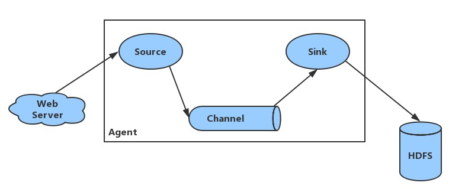

###### 2.2. 组件及其作用

- `Client`：客户端，`Client`生产数据，运行在一个独立的线程中
- `Event`：是Flume NG数据传输的基本单元。一个Event由标题和正文组成：前者是键/值映射，后者是任意字节数组（`Event`可以是日志记录，`Avro`对象等）
- `Flow`：`Event`从源点到达目的点的迁移的抽象
- `Agent`：是一个对的Flume进程，运行在JVM中，包含组件`Source`、`Channel`、`Sink`。每台机器运行一个`Agent`，但是一个`Agent`中可以包含多个`Sources`和`Sinks`
- `Source`：数据收集组件，从外部数据源收集数据，并存储到`Channel`中
- `Channel`：是源和接收器之间的管道，用于临时存储数据。可以是内存或持久化的文件系统
  - `Memory Channel`：使用内存，优点是速度快，但数据可能会丢失（如突然宕机）
  - `File Channel`：使用持久化的文件系统，优点是能保证数据不丢失，但是速度慢
- `Sink`：负责从`Channel`中读取`Event`，并将其存入外部存储系统或者将其转发到下一个`Source`，成功后从`Channel`中移除`Event`
- `Seletor`：选择器，作用于`Source`端，然后决定数据发往那个目标
- `Interceptor`：拦截器，Flume允许使用拦截器拦截数据，允许使用拦截器链，作用于`Source`和`Sink`阶段

###### 2.3. 组件的种类

- `Source`类型：`Avro Source`，`Thrift Source`，`Exec Source`，`JMS Source`，`Spooling Directory Source`，`Taildir Source`，`Twitter 1% firehose Source`，`Kafka Source`，`NetCat TCP Source`，`NetCat UDP Source`，`Sequence Generator Source`，`Syslog Source`，`HTTP Source`，`Stress Source`，`Legacy Source`，`Custom Source`，`Scribe Source`
- `Sink`类型：`HDFS Sink`，`Hive Sink`，`Logger Sink`，`Avro Sink`，`Thrift Sink`，`IRC Sink`，`File Roll Sink`，`Null Sink`，`HBaseSinks(HBaseSink，HBase2Sink，AsyncHBaseSink)`，`MorphlineSolrSink`，`ElasticSearchSink`，`Kite Dataset Sink`，`Kafka Sink`，`HTTP Sink`，`Custom Sink`
- `Channer`类型：`Memory Channel`，`JDBC Channel`，`Kafka Channel`，`File Channel`，`Spillable Memory Channel`，`Pseudo Transaction Channel`，`Custom Channel`
- `Channel Selector`类型：`Replicating Channel Selector(default)`，`Multiplexing Channel Selector`，`Custom Channel Selector`
- `Sink Processor`类型：`Default Sink Processor`，`Failover Sink Processor`，`Load balancing Sink Processor`，`Custom Sink Processor`
- `Interceptor`类型：`Timestamp Interceptor`，`Host Interceptor`，`Static Interceptor`，`Remove Header Interceptor`，`UUID Interceptor`，`Morphline Intercreptor`，`Search and Replace Interceptor`，`Regex Filtering Interceptor`，`Regex Extractor Interceptor`

##### 3. Flume的架构模式

---

###### 3.1. 单一数据模型


```
在单个Agent内由单个Source、Channel、Sink建立一个单一的数据流模型，整个数据流为Web Server --> Source --> Channel --> Sink --> HDFS
```

###### 3.2. 多数据流模型

- multi-agent flow（多`Agent`串行传输数据流模型）

  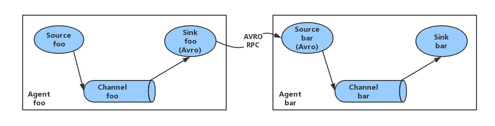

  ```
  Flume支持跨多个Agent的数据传输，这要求前一个的Agent的Sink和下一个Agent的Source都必须是Avro类型，Sink指向Source所在的主机名（或IP地址）和端口
  ```

- Consolidation（多`Agent`汇聚数据流模型）

  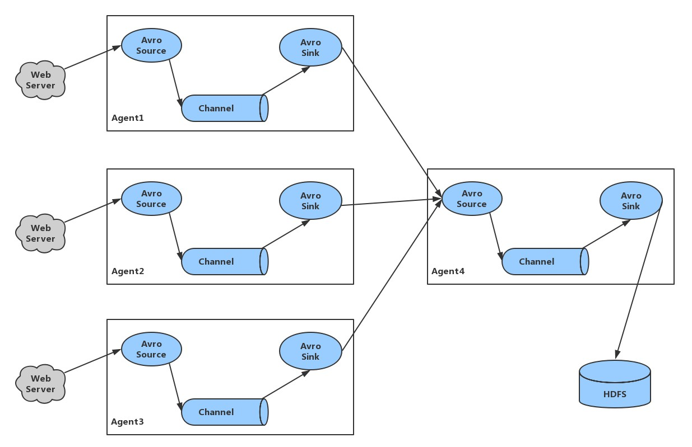

  ```
  日志收集中常常存在着大量的客户端（比如分布式Web服务），Flume支持使用多个Agent分别收集日志，然后通过一个或多个Agent聚合后再存储到文件系统中
  ```

- Multiplexing the flow（单`Agent`多路数据流模型）

  

  ```
  Flume支持从一个Source向多个Channel，也就是向多个Sink传递事件，这个操作称之为Fan Out（扇出）。默认情况下Fan Out是向所有的Channel复制Event，即所有Channel收到的树都是相同的。同时Flume也支持在Source上自定义一个复用选择器（multiplexing selector）来实现自定义的路由规则
  ```

- Sinkgroups数据流模型

  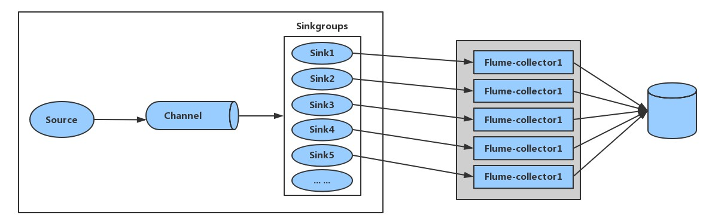

###### 3.3. 总结

```
在Flume提供的数据流模型中，几个原则非常重要：

1. Source --> Channel
	- 单个Source组件可以和多个Channel组合建立数据流，可以replication和multiplexing
	- 多个Source可以写入单个Channel
	
2. Channel --> Sink
	- 多个Sink又可以组合成Sinkgroups从Channel中获取数据，可以loadbalancing和failover机制
	- 多个Sinks也可以从单个Channel中取数据
	- 单个Sink只能从单个Channel中取数据
```

##### 4. Flume的配置格式

---

> Flume配置通常需要以下步骤：

1. 分别定义好`Agent`的`Sources`、`Sinks`、`Channels`，然后将`Sources`和`Sinks`与通道进行绑定。需要注意的是一个`Source`可以配置多个`Channel`，但一个`Sink`只能配置一个`Channel`。基本格式如下：

   ```properties
   <Agent>.sources = <Source>
   <Agent>.sinks = <Sink>
   <Agent>.channels = <Channel1> <Channel2>
   
   # set channel for source
   <Agent>.sources.<Source>.channels = <Channel1> <Channel2> ...
   
   # set channel for sink
   <Agent>.sinks.<Sink>.channel = <Channel1>
   ```

2. 分别定义`Source`、`Sink`、`Channel`的具体属性。基本格式如下：

   ```properties
   # properties for sources
   <Agent>.sources.<Source>.<someProperty> = <someValue>
   
   # properties for channels
   <Agent>.channels.<Channel>.<someProperty> = <someValue>
   
   # properties for sinks
   <Agent>.sinks.<Sink>.<someProperty> = <someValue>
   ```

##### 5. Flume的使用案例

---

- 案例一：使用`Flume`监听文件内容变动，将新增的内容输出到控制台
- 案例二：使用`Flume`监听指定目录，将目录下新增的文件存储到HDFS
- 案例三：使用`Avro`将本服务器的日志收集起来发送到另一台服务器
- 案例四：使用`HTTP Source`产生数据，使用正则拦截器进行拦截信息，将新增信息输出到控制台
- 案例五：使用`HTTP Source`产生数据，选择器为`Replicating Channel Selector`，将一个`HTTP Source`的数据打印在控制台，一个保存在hdfs上
- 案例六：使用`HTTP Source`产生数据，选择器为`Multiplexing Channel Selector`，将`Read`请求打印到控制台，将`WRITE`请求保存到hdfs上，除此之外的请求使用默认，打印到控制台
- 案例七：多`Agent`汇聚流模型，将slave1和slave2上的日志收集起来，交给master进行日志聚合
- 案例八：配置`Sinkgroups`，使用`Failover Sink Processor`实现多`Sink`高可用

###### 5.1. 案例一

> 需求：监听文件内容变动，将新增内容输出到控制台
>
> 实现：主要使用`Exec Source`配置`tail`命令实现

1. 配置

   > 新建配置文件`exec-memory-logger.properties`，内容如下：

   ```properties
   # 指定agent的sources,sinks,channels
   a1.sources = s1
   a1.sinks = k1
   a1.channels = c1
   
   # 配置sources属性
   a1.sources.s1.type = exec
   a1.sources.s1.command = tail -f /opt/apps/nginx/logs/access.log
   
   # 配置sinks属性
   a1.sinks.k1.type = logger
   
   # 配置channels属性
   a1.channels.c1.type = memory
   a1.channels.c1.capacity = 10000
   a1.channels.c1.transactionCapacity = 10000
   a1.channels.c1.byteCapacityBufferPercentage = 20
   a1.channels.c1.byteCapacity = 800000
   
   # 连接三个组件
   a1.sources.s1.channels = c1
   a1.sinks.k1.channel = c1
   ```

2. 启动

   ```shell
   [yangqi@master ~]$ flume-ng agent --conf /opt/apps/flume-1.7.0/conf/ --conf-file /opt/apps/flume-1.7.0/examples/exec-memory-logger.properties --name a1 -Dflume.root.logger=INFO,console
   
   [yangqi@master ~]$ flume-ng agent -c /opt/apps/flume-1.7.0/conf/ -f /opt/apps/flume-1.7.0/examples/exec-memory-logger.properties -n a1 -Dflume.root.logger=INFO,console
   ```

3. 测试

   > 我这里监视的是nginx的日志文件，所以直接刷新网页即可

   > 此时控制台的输出

   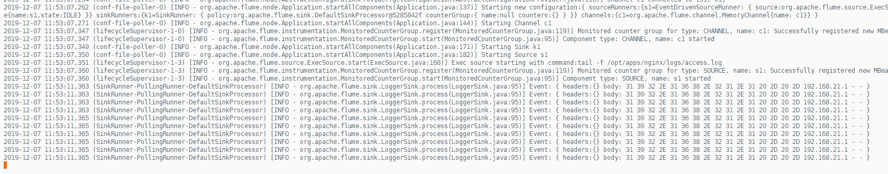

   > 刷新一下网页即可，看到监听到了一条日志信息

   

###### 5.2. 案例二

> 需求：监听指定目录，将目录下新增的文件存储到HDFS
>
> 实现：使用`Spooling Directory Source`和`HDFS Sink`

1. 配置

   > 新建配置文件`spooling-memory-hdfs.properties`，内容如下：

   ```properties
   # 指定agent的sources,sinks,channels
   a1.sources = s1
   a1.sinks = k1
   a1.channels = c1
   
   # 配置sources的属性
   a1.sources.s1.type = spooldir
   a1.sources.s1.spoolDir = /opt/apps/nginx/logs/
   a1.sources.s1.basenameHeader = true
   
   # 配置sinks的属性
   a1.sinks.k1.type = hdfs
   a1.sinks.k1.hdfs.path = /flume/events/%Y-%m-%d/%H/
   a1.sinks.k1.hdfs.filePrefix = %{fileName}
   # 生成文件的类型，默认是Sequencefile，可以用DataStream，则为普通文件
   a1.sinks.k1.hdfs.fileType = DataStream
   a1.sinks.k1.hdfs.useLocalTimeStamp = true
   
   # 配置channels的属性
   a1.channels.c1.type = memory
   a1.channels.c1.capacity = 10000
   a1.channels.c1.transactionCapacity = 10000
   a1.channels.c1.byteCapacityBufferPercentage = 20
   a1.channels.c1.byteCapacity = 800000
   
   # 连接三个组件
   a1.sources.s1.channels = c1
   a1.sinks.k1.channel = c1
   ```

2. 启动

   ```shell
   [yangqi@master ~]$ flume-ng agent --conf /opt/apps/flume-1.7.0/conf/ --conf-file /opt/apps/flume-1.7.0/examples/sqooling-memory-hdfs.properties --name a1 -Dflume.root.logger=INFO,console
   
   [yangqi@master ~]$ flume-ng agent -c /opt/apps/flume-1.7.0/conf/ -f /opt/apps/flume-1.7.0/examples/sqooling-memory-hdfs.properties -n a1 -Dflume.root.logger=INFO,console
   ```

3. 测试

   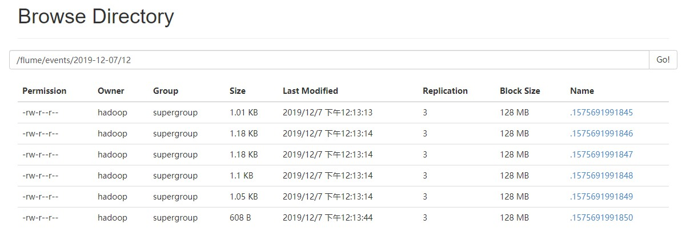

###### 5.3. 案例三

> 需求：将本服务器的日志收集起来发送到另一台服务器
>
> 实现：使用`Avro Source`和`Avro Sink`

1. 配置日志收集的`Agent`

   > 新建配置文件`net-memory-avro.properties`，内容如下：（在服务器standby机器上）

   ```properties
   # 指定agent的sources,sinks.channels
   a1.sources = s1
   a1.sinks = k1
   a1.channels = c1
   
   # 配置sources的属性
   a1.sources.s1.type = exec
   a1.sources.s1.command = tail -f /opt/apps/nginx/logs/access.log
   
   # 配置sinks的属性
   a1.sinks.k1.type = avro
   a1.sinks.k1.hostname = master
   a1.sinks.k1.port = 10001
   a1.sinks.k1.batch-size = 1
   
   # 配置channels的属性
   a1.channels.c1.type = memory
   a1.channels.c1.capacity = 10000
   a1.channels.c1.transactionCapacity = 10000
   a1.channels.c1.byteCapacityBufferPercentage = 20
   a1.channels.c1.byteCapacity = 800000
   
   # 连接三个组件
   a1.sources.s1.channels = c1
   a1.sinks.k1.channel = c1
   ```

2. 配置日志聚合的`Agent`

   > 新建配置文件`avro-memory-logger.properties`，内容如下：（在master机器上）

   ```properties
   # 指定agent的sources,sinks,channels
   a1.sources = s1
   a1.sinks = k1
   a1.channels = c1
   
   # 配置sources的属性
   a1.sources.s1.type = avro
   a1.sources.s1.bind = master
   a1.sources.s1.port = 10001
   
   # 配置sinks的属性
   a1.sinks.k1.type = logger
   
   # 配置channels的类型
   a1.channels.c1.type = memory
   a1.channels.c1.capacity = 10000
   a1.channels.c1.transactionCapacity = 10000
   a1.channels.c1.byteCapacityBufferPercentage = 20
   a1.channels.c1.byteCapacity = 800000
   
   # 连接三个组件
   a1.sources.s1.channels = c1
   a1.sinks.k1.channel = c1
   ```

3. 启动

   ```shell
   # 启动时先启动日志聚合的agent，然后再启动日志收集的agent
   # 日志聚合的agent（master）
   [yangqi@master ~]$ flume-ng agent -c /opt/apps/flume-1.7.0/conf/ -f /opt/apps/flume-1.7.0/examples/avro-memory-logger.properties -n a1 -Dflume.root.logger=INFO,console
   
   # 日志收集的agent（standby）
   [yangqi@standby ~]$ flume-ng agent -c /opt/apps/flume-1.7.0/conf/ -f /opt/apps/flume-1.7.0/examples/net-memory-avro.properties -n a1 -Dflume.root.logger=INFO,console
   ```

4. 测试

   > 服务器（standby）的监听

   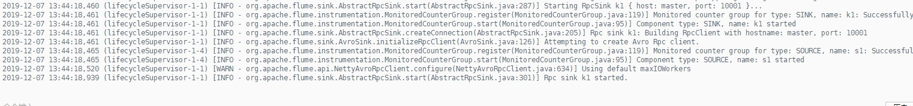

   > 日志聚合服务器（master）的监听

   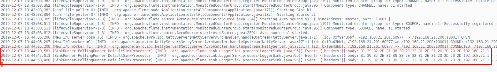

###### 5.4. 案例四

> 需求：通过使用拦截器拦截以数字开头的任意数据，并以`logger`打印在控制台
>
> 实现：使用`HTTP Source`产生数据，拦截器为`Regex Filtering Interceptor`

1. 配置

   > 新建配置文件`http-memoty-logger.properties`，内容如下：

   ```properties
   # 指定agent的sources,sinks,channels
   a1.sources = s1
   a1.sinks = k1
   a1.channels = c1
   
   # 配置sources的属性
   a1.sources.s1.type = http
   a1.sources.s1.bind = master
   a1.sources.s1.port = 10002
   a1.sources.s1.interceptors = i1
   a1.sources.s1.interceptors.i1.type = regex_filter
   a1.sources.s1.interceptors.i1.regex = ^[0-9].*$
   a1.sources.s1.interceptors.i1.excludeEvents = false
   
   # 配置sinks的属性
   a1.sinks.k1.type = logger
   
   # 配置channels的属性
   a1.channels.c1.type = memory
   a1.channels.c1.capacity = 10000
   a1.channels.c1.transactionCapacity = 10000
   a1.channels.c1.byteCapacityBufferPercentage = 20
   a1.channels.c1.byteCapacity = 800000
   
   # 连接三个组件
   a1.sources.s1.channels = c1
   a1.sinks.k1.channel = c1
   ```

2. 启动

   ```shell
   [yangqi@master ~]$ flume-ng agent -c /opt/apps/flume-1.7.0/conf/ -f /opt/apps/flume-1.7.0/examples/http-memory-logger.properties -n a1 -Dflume.root.logger=INFO,console
   ```

3. 测试

   > 使用curl产生数据

   ```shell
   [yangqi@master ~]$ curl -X POST -d '[{"headers":{"k1":"param1","k2":"parm2"},"body":"666 is http"}]' http://master:10002
   
   [yangqi@master ~]$ curl -X POST -d '[{"headers":{"k1":"param1","k2":"parm2"},"body":"this is http"}]' http://master:10002
   ```

   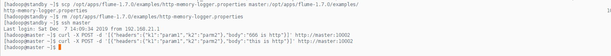

   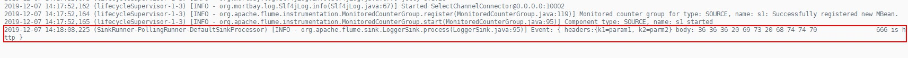

###### 5.5. 案例五

> 需求：使用replicating选择器，将flume信息发送到hdfs和logger
>
> 实现：使用`HTTP Source`产生数据，选择器为`Replicating Channel Selector`

1. 配置

   > 新建配置文件`http-memory-hdfs-logger.properties`，内容如下：

   ```properties
   # 指定agent的sources,sinks,channels
   a1.sources = s1
   a1.sinks = k1 k2
   a1.channels = c1 c2
   
   # 配置sources的属性
   a1.sources.s1.type = http
   a1.sources.s1.bind = master
   a1.sources.s1.port = 10003
   a1.sources.s1.selector.type = replicating
   a1.sources.s1.selector.optional = c2
   
   # 配置sinks的属性
   a1.sinks.k1.type = logger
   
   a1.sinks.k2.type = hdfs
   a1.sinks.k2.hdfs.path = /flume/events/replicating/
   a1.sinks.k2.hdfs.filePrefix = %{fileName}
   a1.sinks.k2.hdfs.fileType = DataStream
   a1.sinks.k2.hdfs.wtireFormat = Text
   a1.sinks.k2.hdfs.round = true
   a1.sinks.k2.hdfs.roundValue = 1
   a1.sinks.k2.hdfs.roundUnit = minute
   a1.sinks.k2.hdfs.useLocalTimeStamp = true
   
   # 配置channels的属性
   a1.channels.c1.type = memory
   
   a1.channels.c2.type = memory
   a1.channels.c2.capacity = 10000
   a1.channels.c2.transactionCapacity = 10000
   a1.channels.c2.byteCapacityBufferPercentage = 20
   a1.channels.c2.byteCapacity = 800000
   
   # 连接三个组件
   a1.sources.s1.channels = c1 c2
   a1.sinks.k1.channel = c1
   a1.sinks.k2.channel = c2
   ```

2. 启动

   ```shell
   [yangqi@master ~]$ flume-ng agent -c /opt/apps/flume-1.7.0/conf/ -f /opt/apps/flume-1.7.0/examples/http-memory-hdfs-logger.properties -n a1 -Dflume.root.logger=INFO,console
   ```

3. 测试

   > 远程连接master，发送两条数据

   ```shell
   [yangqi@master ~]$ curl -X POST -d '[{"headers":{"k1":"param1","k2":"parm2"},"body":"666 is http"}]' http://master:10002
   ```

   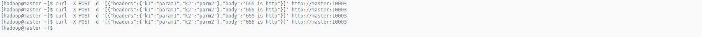

   > 在master上的控制台上，可以看到日志

   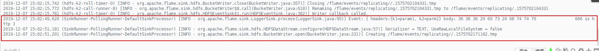

   > 同时在hdfs上也可以看到日志

   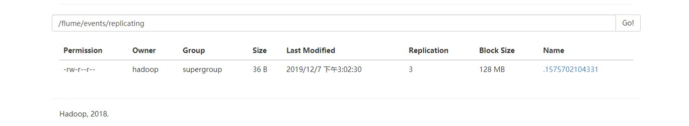

###### 5.6. 案例六

> 需求：使用`Chnnels`连接`Sinks`，将不同的访问请求收集在不同的地方
>
> 实现：使用`HTTP Source`产生数据，选择器为`Mulitplexing Channel Selector`

1. 配置

   > 新建配置文件`http-memory-multiplexing-logger-hdfs.properties`，内容如下：

   ```properties
   # 指定agent的sources,sinks,channels
   a1.sources = s1
   a1.sinks = k1 k2
   a1.channels = c1 c2
   
   # 配置sources的属性
   a1.sources.s1.type = http
   a1.sources.s1.bind = master
   a1.sources.s1.port = 10004
   a1.sources.s1.selector.type = multiplexing
   a1.sources.s1.selector.head = state
   a1.sources.s1.mapping.READ = c1
   a1.sources.s1.mapping.WRITE = c2
   a1.sources.s1.selector.default = c
   
   # 配置sinks的属性
   a1.sinks.k1.type = logger
   
   a1.sinks.k2.type = hdfs
   a1.sinks.k2.hdfs.path = /flume/events/multiplexing
   a1.sinks.k2.hdfs.filePrefix = events-
   a1.sinks.k2.hdfs.fileType = DataStream
   a1.sinks.k2.hdfs.writeFormat = Text
   a1.sinks.k2.hdfs.round = true
   a1.sinks.k2.hdfs.roundValue = 1
   a1.sinks.k2.hdfs.roundUnit = minute
   a1.sinks.k2.hdfs.useLocalTimeStamp = true
   
   # 配置channels的属性
   a1.channels.c1.type = memory
   
   a1.channels.c2.type = memory
   a1.channels.c2.capacity = 10000
   a1.channels.c2.transactionCapacity = 1000
   a1.channels.c2.byteCapacityBufferPercentage = 20
   a1.channels.c2.byteCapacity = 800000
   
   # 连接三个组件
   a1.sources.s1.channels = c1 c2
   a1.sinks.k1.channel = c1
   a1.sinks.k2.channel = c2
   ```

2. 启动

   ```shell
   [yangqi@master ~]$ flume-ng agent -c /opt/apps/flume-1.7.0/conf/ -f /opt/apps/flume-1.7.0/examples/http-memory-multiplexing-logger-hdfs.properties -n a1 -Dflume.root.logger=INFO,console
   ```

3. 测试

   > 使用curl发送http请求，产生数据

   ```shell
   [yangqi@master ~]$ curl -X POST -d '[{"headers":{"state":"READ"},"body":"099 is http"}]' http://master:10004
   ```

   > 测试未通过，稍后测试

###### 5.7. 案例七

> 需求：实现多`Agent`收集日志信息，一个`Agent`聚合日志信息
>
> 实现：使用`HTTP Source`在slave1和slave2上产生数据，并进行收集，然后将收集的日志信息发送给master的`agent`进行处理

1. 配置日志收集的`Agent`

   > 在slave1上配置日志收集的`agent`，新建配置文件`http-memory-avro.properties`，内容如下：

   ```properties
   # 指定agent的sources,sinks,chanels
   a1.sources = s1
   a1.sinks = k1
   a1.channels = c1
   
   # 配置sources的属性
   a1.sources.s1.type = http
   a1.sources.s1.bind = slave1
   a1.sources.s1.port = 10005
   
   # 配置sinks的属性
   a1.sinks.k1.type = avro
   a1.sinks.k1.hostname = master
   a1.sinks.k1.port = 10006
   
   # 配置channels的属性
   a1.channels.c1.type = memory
   a1.channels.c1.capacity = 10000
   a1.channels.c1.transactionCapacity = 10000
   a1.channels.c1.byteCapacityBufferPercentage = 20
   a1.channels.c1.byteCapacity = 800000
   
   # 连接三个组件
   a1.sources.s1.channels = c1
   a1.sinks.k1.channel = c1
   ```

   > 在slave2上配置日志收集的`agent`，新建配置文件`http-memory-avro.properties`，内容如下：

   ```properties
   # 指定agent的sources,sinks,chanels
   a1.sources = s1
   a1.sinks = k1
   a1.channels = c1
   
   # 配置sources的属性
   a1.sources.s1.type = http
   a1.sources.s1.bind = slave2
   a1.sources.s1.port = 10005
   
   # 配置sinks的属性
   a1.sinks.k1.type = avro
   a1.sinks.k1.hostname = master
   a1.sinks.k1.port = 10006
   
   # 配置channels的属性
   a1.channels.c1.type = memory
   a1.channels.c1.capacity = 10000
   a1.channels.c1.transactionCapacity = 10000
   a1.channels.c1.byteCapacityBufferPercentage = 20
   a1.channels.c1.byteCapacity = 800000
   
   # 连接三个组件
   a1.sources.s1.channels = c1
   a1.sinks.k1.channel = c1
   ```

   > 在master上配置日志聚合的`agent`，新建配置文件`avro-memory-logger-logger.properties`，内容如下：

   ```properties
   # 指定agent的sources,sinks,channels
   a1.sources = s1
   a1.sinks = k1
   a1.channels = c1
   
   # 配置sources的属性
   a1.sources.s1.type = avro
   a1.sources.s1.bind = master
   a1.sources.s1.port = 10006
   
   # 配置sinks的属性
   a1.sinks.k1.type = logger
   
   # 配置channels的属性
   a1.channels.c1.type = memory
   a1.channels.c1.capacity = 10000
   a1.channels.c1.transactionCapacity = 10000
   a1.channels.c1.byteCapacityBufferPercentage = 20
   a1.channels.c1.byteCapacity = 800000
   
   # 连接三个组件
   a1.sources.s1.channels = c1
   a1.sinks.k1.channel = c1
   ```

2. 启动

   > 先启动日志聚合的`agent`（master）

   ```shell
   [yangqi@master ~]$ flume-ng agent -c /opt/apps/flume-1.7.0/conf/ -f /opt/apps/flume-1.7.0/examples/avro-memory-logger-logger.properties -n a1 -Dflume.root.logger=INFO,console
   ```

   > 启动日志收集的`agent`（slave1和slave2）

   ```shell
   [yangqi@slave1 ~]$ flume-ng agent -c /opt/apps/flume-1.7.0/conf/ -f /opt/apps/flume-1.7.0/examples/http-memory-avro.properties -n a1 -Dflume.root.logger=INFO,console
   
   [yangqi@slave2 ~]$ flume-ng agent -c /opt/apps/flume-1.7.0/conf/ -f /opt/apps/flume-1.7.0/examples/http-memory-avro.properties -n a1 -Dflume.root.logger=INFO,console
   ```

3. 测试

   > 在slave1和slave2分别使用curl产生数据

   ```shell
   [yangqi@slave1 ~]$ curl -X POST -d '[{"headers":{"k1":"param1", "k2":"param2"},"body":"099 is http"}]' http://slave1:10005
   
   [yangqi@slave1 ~]$ curl -X POST -d '[{"headers":{"k1":"param1", "k2":"param2"},"body":"000 is http"}]' http://slave2:10005
   ```

   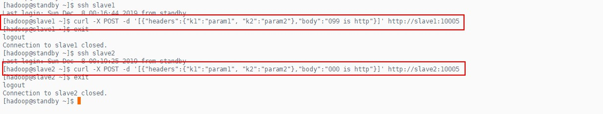

   > 在master的控制台上，可以看到打印出了日志信息

   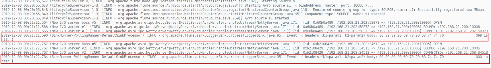

###### 5.8. 案例八

> 需求：使用一个`Channel`连接两个`Sink`，实现`Sink`的高可用
>
> 实现：使用`Sinkgoups`和`Failover Sink Processor`来实现`Sink`失败转移

1. 配置日志收集的`Agent`

   > 新建配置文件`exec-memory-sinkgroups-avro.properties`，内容如下：（在服务器standby上）

   ```properties
   # 指定agent的sources,sinks,channels
   a1.sources = s1
   a1.sinkgroups = g1
   a1.channels = c1
   a1.sinks = k1 k2
   
   # 配置sources的属性
   a1.sources.s1.type = exec
   a1.sources.s1.command = tail -f /opt/apps/nginx/logs/access.log
   
   # 配置sinks的属性
   a1.sinks.k1.type = avro
   a1.sinks.k1.hostname = slave1
   a1.sinks.k1.port = 10004
   a1.sinks.k1.batch-size = 1
   
   a1.sinks.k2.type = avro
   a1.sinks.k2.hostname = slave2
   a1.sinks.k2.port = 10004
   a1.sinks.k2.batch-size = 1
   
   # 配置sinkgroups的属性
   a1.sinkgroups.g1.sinks = k1 k2
   a1.sinkgroups.g1.processor.type = failover
   a1.sinkgroups.g1.processor.priority.k1 = 5
   a1.sinkgroups.g1.processor.priority.k2 = 10
   a1.sinkgroups.g1.processor.maxpenalty = 10000
   
   # 配置channels的属性
   a1.channels.c1.type = memory
   a1.channels.c1.capacity = 10000
   a1.channels.c1.transactionCapacity = 10000
   a1.channels.c1.byteCapacityBufferPercentage = 20
   a1.channels.c1.byteCapacity = 800000
   
   # 连接三个组件
   a1.sources.s1.channels = c1
   a1.sinks.k1.channel = c1
   a1.sinks.k2.channel = c1
   ```

2. 配置日志聚合的`Agent`

   > 新建配置文件`avro-memory-logger.properties`，内容如下：（在服务器slave1上）

   ```properties
   # 指定agent的sources,sinks,channels
   a1.sources = s1
   a1.sinks = k1
   a1.channels = c1
   
   # 配置sources的属性
   a1.sources.s1.type = avro
   a1.sources.s1.bind = slave1
   a1.sources.s1.port = 10004
   
   # 配置sinks的属性
   a1.sinks.k1.type = logger
   
   # 配置channels的类型
   a1.channels.c1.type = memory
   a1.channels.c1.capacity = 10000
   a1.channels.c1.transactionCapacity = 10000
   a1.channels.c1.byteCapacityBufferPercentage = 20
   a1.channels.c1.byteCapacity = 800000
   
   # 连接三个组件
   a1.sources.s1.channels = c1
   a1.sinks.k1.channel = c1
   ```

   > 新建配置文件`avro-memory-logger.properties`，内容如下：（在服务器slave2上）

   ```properties
   # 指定agent的sources,sinks,channels
   a1.sources = s1
   a1.sinks = k1
   a1.channels = c1
   
   # 配置sources的属性
   a1.sources.s1.type = avro
   a1.sources.s1.bind = slave2
   a1.sources.s1.port = 10004
   
   # 配置sinks的属性
   a1.sinks.k1.type = logger
   
   # 配置channels的类型
   a1.channels.c1.type = memory
   a1.channels.c1.capacity = 10000
   a1.channels.c1.transactionCapacity = 10000
   a1.channels.c1.byteCapacityBufferPercentage = 20
   a1.channels.c1.byteCapacity = 800000
   
   # 连接三个组件
   a1.sources.s1.channels = c1
   a1.sinks.k1.channel = c1
   ```

3. 启动

   > 首先启动服务器slave1和slave2的`agent`

   ```shell
   [yangqi@slave1 ~]$ flume-ng agent -c /opt/apps/flume-1.7.0/conf/ -f /opt/apps/flume-1.7.0/examples/avro-memory-logger.properties -n a1 -Dflume.root.logger=INFO,console
   
   [yangqi@slave2 ~]$ flume-ng agent -c /opt/apps/flume-1.7.0/conf/ -f /opt/apps/flume-1.7.0/examples/avro-memory-logger.properties -n a1 -Dflume.root.logger=INFO,console
   ```

   > 启动服务器standby的`agent`

   ```shell
   [yangqi@standby ~]$ flume-ng agent -c /opt/apps/flume-1.7.0/conf/ -f /opt/apps/flume-1.7.0/examples/exec-memory-sinkgroups-avro.properties -n a1 -Dflume.root.logger=INFO,console
   ```

4. 测试

   > 使用浏览器访问`nginx`服务器，产生日志，可以在slave2上看到日志信息已经打印在了控制台

   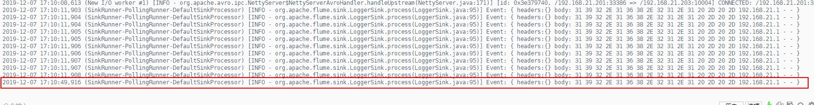

   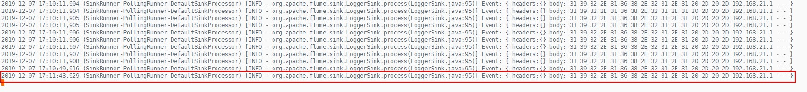

   > 现在模拟让slave2宕机，查看slave1是否监听到了日志信息

   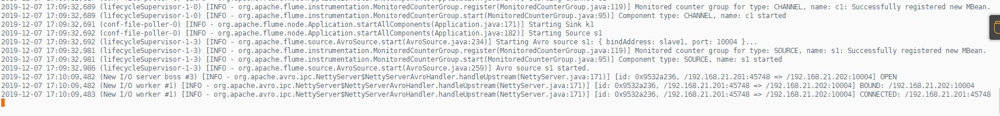

   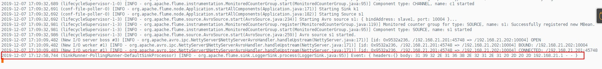