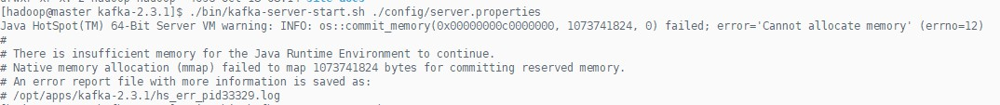
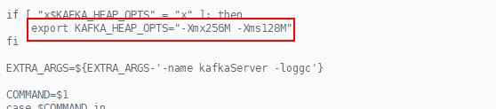
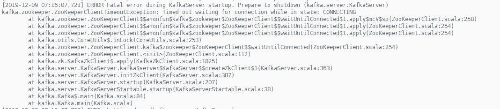
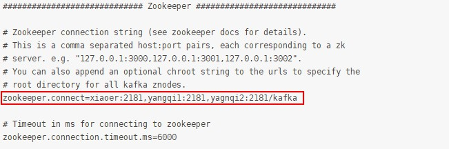
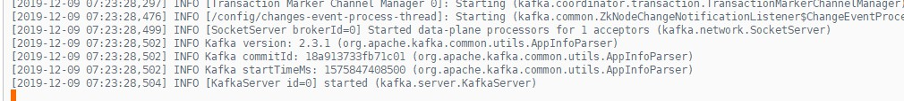
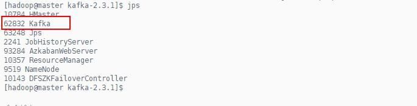

#### Kafka的安装

##### 下载及上传

此处使用Kafka的2.3.1版本进行安装，下载地址：http://kafka.apache.org/downloads

下载完成之后将下载好的kafka_2.11-2.3.1.tgz安装包上传到所要安装的Linux服务器上，我的软件安装包放在`/opt/software/`下

##### 单机模式安装

将Kafka_2.11-2.3.1.tgz解压在`/opt/apps/`目录下

```shell
[yangqi@xiaoer ~]$ tar -zvxf /opt/software/kafka_2.11-2.3.1.tgz -C /opt/apps/
[yangqi@xiaoer ~]$ cd /opt/apps/
```

启动服务

`kafka`使用了`zookeeper`，因此在启动`kafka`之前，要先启动`zookeeper`服务（我已经启动了`zookeeper`服务）

直接启动`kafka`服务：

```shell
[yangqi@xiaoer apps]$ cd kafka_2.11-2.3.1/
[yangqi@xiaoer kafka_2.11-2.3.1]$ ./bin/kafka-server-start.sh ./config/server.properties
```

一般情况下，首次启动`kafka`都会报错，显示JVM内存不足：



此时可以修改一下`kafka-server-start.sh`的配置，将JVM的内存调小一点

```shell
[yangqi@xiaoer kafka_2.11-2.3.1]$ vi ./bin/kafka-server.start.sh
```



再次重新启动`kafka`服务：

```shell
[yangqi@xiaoer kafka_2.11-2.3.1]$ ./bin/kafka-server-start.sh ./config/server.properties
```

如果你们的集群和笔者的一样，`zookeeper`集群是单独安装的，并没有安装在master机器上，那么可能会出现以下错误，说明`kafka`在连接`zookeeper`时连接失败，可以修改`./config/server.properties`中的内容



修改内容如下：（修改成你自己的`zookeeper`集群的位置）



重新启动`kafka`服务：（如果没有报错则启动成功）

```shell
[yangqi@xiaoer kafka_2.11-2.3.1]$ ./bin/kafka-server-start.sh ./config/server.properties
```



此时可以先使用`Crtl+C`结束`kafka`的相关服务

将`kafka`服务放到后台启动：

```shell
[yangqi@xiaoer kafka_2.11-2.3.1]$ nohup ./bin/kafka-server-start.sh ./config/server.properties >/dev/null 2>&1 &
```



##### 集群模式安装

###### 准备环境

准备三台虚拟机，安装好`zookeeper`，并已经配置成功（我的三台虚拟机均安装了`zookeeper`）

###### 编辑`server.properties`文件

```shell
[yangqi@xiaoer kafka_2.11-2.3.1]$ vi ./config/server.properties
```

修改其中以下内容：

```shell
# 修改broker.id=1
############################# Server Basics #############################
# The id of the broker. This must be set to a unique integer for each broker.
broker.id=1

# 修改日志文件的路径
log.dirs=/opt/app/kafka-2.3.1/logs

# 增加host.name，设置为自己的主机名
host.name=xiaoer
```

整体内容如下：

```shell
# Licensed to the Apache Software Foundation (ASF) under one or more
# contributor license agreements.  See the NOTICE file distributed with
# this work for additional information regarding copyright ownership.
# The ASF licenses this file to You under the Apache License, Version 2.0
# (the "License"); you may not use this file except in compliance with
# the License.  You may obtain a copy of the License at
#
#    http://www.apache.org/licenses/LICENSE-2.0
#
# Unless required by applicable law or agreed to in writing, software
# distributed under the License is distributed on an "AS IS" BASIS,
# WITHOUT WARRANTIES OR CONDITIONS OF ANY KIND, either express or implied.
# See the License for the specific language governing permissions and
# limitations under the License.

# see kafka.server.KafkaConfig for additional details and defaults

############################# Server Basics #############################

# The id of the broker. This must be set to a unique integer for each broker.
broker.id=1

############################# Socket Server Settings #############################

# The address the socket server listens on. It will get the value returned from 
# java.net.InetAddress.getCanonicalHostName() if not configured.
#   FORMAT:
#     listeners = listener_name://host_name:port
#   EXAMPLE:
#     listeners = PLAINTEXT://your.host.name:9092
#listeners=PLAINTEXT://:9092

# Hostname and port the broker will advertise to producers and consumers. If not set, 
# it uses the value for "listeners" if configured.  Otherwise, it will use the value
# returned from java.net.InetAddress.getCanonicalHostName().
#advertised.listeners=PLAINTEXT://your.host.name:9092

# Maps listener names to security protocols, the default is for them to be the same. See the config documentation for more details
#listener.security.protocol.map=PLAINTEXT:PLAINTEXT,SSL:SSL,SASL_PLAINTEXT:SASL_PLAINTEXT,SASL_SSL:SASL_SSL

# The number of threads that the server uses for receiving requests from the network and sending responses to the network
num.network.threads=3

# The number of threads that the server uses for processing requests, which may include disk I/O
num.io.threads=8

# The send buffer (SO_SNDBUF) used by the socket server
socket.send.buffer.bytes=102400

# The receive buffer (SO_RCVBUF) used by the socket server
socket.receive.buffer.bytes=102400

# The maximum size of a request that the socket server will accept (protection against OOM)
socket.request.max.bytes=104857600


############################# Log Basics #############################

# A comma separated list of directories under which to store log files
log.dirs=/opt/apps/kafka-2.3.1/logs

# The default number of log partitions per topic. More partitions allow greater
# parallelism for consumption, but this will also result in more files across
# the brokers.
num.partitions=1

# The number of threads per data directory to be used for log recovery at startup and flushing at shutdown.
# This value is recommended to be increased for installations with data dirs located in RAID array.
num.recovery.threads.per.data.dir=1

############################# Internal Topic Settings  #############################
# The replication factor for the group metadata internal topics "__consumer_offsets" and "__transaction_state"
# For anything other than development testing, a value greater than 1 is recommended for to ensure availability such as 3.
offsets.topic.replication.factor=1
transaction.state.log.replication.factor=1
transaction.state.log.min.isr=1

############################# Log Flush Policy #############################

# Messages are immediately written to the filesystem but by default we only fsync() to sync
# the OS cache lazily. The following configurations control the flush of data to disk.
# There are a few important trade-offs here:
#    1. Durability: Unflushed data may be lost if you are not using replication.
#    2. Latency: Very large flush intervals may lead to latency spikes when the flush does occur as there will be a lot of data to flush.
#    3. Throughput: The flush is generally the most expensive operation, and a small flush interval may lead to excessive seeks.
# The settings below allow one to configure the flush policy to flush data after a period of time or
# every N messages (or both). This can be done globally and overridden on a per-topic basis.

# The number of messages to accept before forcing a flush of data to disk
#log.flush.interval.messages=10000

# The maximum amount of time a message can sit in a log before we force a flush
#log.flush.interval.ms=1000

############################# Log Retention Policy #############################

# The following configurations control the disposal of log segments. The policy can
# be set to delete segments after a period of time, or after a given size has accumulated.
# A segment will be deleted whenever *either* of these criteria are met. Deletion always happens
# from the end of the log.

# The minimum age of a log file to be eligible for deletion due to age
log.retention.hours=168

# A size-based retention policy for logs. Segments are pruned from the log unless the remaining
# segments drop below log.retention.bytes. Functions independently of log.retention.hours.
#log.retention.bytes=1073741824

# The maximum size of a log segment file. When this size is reached a new log segment will be created.
log.segment.bytes=1073741824

# The interval at which log segments are checked to see if they can be deleted according
# to the retention policies
log.retention.check.interval.ms=300000

############################# Zookeeper #############################

# Zookeeper connection string (see zookeeper docs for details).
# This is a comma separated host:port pairs, each corresponding to a zk
# server. e.g. "127.0.0.1:3000,127.0.0.1:3001,127.0.0.1:3002".
# You can also append an optional chroot string to the urls to specify the
# root directory for all kafka znodes.
zookeeper.connect=xiaoer:2181,yangqi1:2181,yagnqi2:2181/kafka

# Timeout in ms for connecting to zookeeper
zookeeper.connection.timeout.ms=6000


############################# Group Coordinator Settings #############################

# The following configuration specifies the time, in milliseconds, that the GroupCoordinator will delay the initial consumer rebalance.
# The rebalance will be further delayed by the value of group.initial.rebalance.delay.ms as new members join the group, up to a maximum of max.poll.interval.ms.
# The default value for this is 3 seconds.
# We override this to 0 here as it makes for a better out-of-the-box experience for development and testing.
# However, in production environments the default value of 3 seconds is more suitable as this will help to avoid unnecessary, and potentially expensive, rebalances during application startup.
group.initial.rebalance.delay.ms=0

host.name=xiaoer
```

###### 编辑`producer.properties`文件

```shell
[yangqi@xiaoer kafka_2.11-2.3.1]$ vi ./config/producer.properties
```

修改其中以下内容：

```shell
bootstrap.servers=xiaoer:9092,yangqi1:9092,yangqi2:9092
```

整体内容如下：

```shell
# Licensed to the Apache Software Foundation (ASF) under one or more
# contributor license agreements.  See the NOTICE file distributed with
# this work for additional information regarding copyright ownership.
# The ASF licenses this file to You under the Apache License, Version 2.0
# (the "License"); you may not use this file except in compliance with
# the License.  You may obtain a copy of the License at
#
#    http://www.apache.org/licenses/LICENSE-2.0
#
# Unless required by applicable law or agreed to in writing, software
# distributed under the License is distributed on an "AS IS" BASIS,
# WITHOUT WARRANTIES OR CONDITIONS OF ANY KIND, either express or implied.
# See the License for the specific language governing permissions and
# limitations under the License.
# see org.apache.kafka.clients.producer.ProducerConfig for more details

############################# Producer Basics #############################

# list of brokers used for bootstrapping knowledge about the rest of the cluster
# format: host1:port1,host2:port2 ...
bootstrap.servers=xiaoer:9092,yangqi1:9092,yangqi2:9092

# specify the compression codec for all data generated: none, gzip, snappy, lz4, zstd
compression.type=none

# name of the partitioner class for partitioning events; default partition spreads data randomly
#partitioner.class=

# the maximum amount of time the client will wait for the response of a request
#request.timeout.ms=

# how long `KafkaProducer.send` and `KafkaProducer.partitionsFor` will block for
#max.block.ms=

# the producer will wait for up to the given delay to allow other records to be sent so that the sends can be batched together
#linger.ms=

# the maximum size of a request in bytes
#max.request.size=

# the default batch size in bytes when batching multiple records sent to a partition
#batch.size=

# the total bytes of memory the producer can use to buffer records waiting to be sent to the server
#buffer.memory=
```

###### 编辑`consumer.properties`文件

```shell
[yangqi@xiaoer kafka_2.11-2.3.1]$ vi ./config/consumer.properties
```

修改其中以下内容：

```shell
bootstrap.servers=xiaoer:9092,yangqi1:9092,yangqi2:9092
```

整体内容如下：

```shell
# Licensed to the Apache Software Foundation (ASF) under one or more
# contributor license agreements.  See the NOTICE file distributed with
# this work for additional information regarding copyright ownership.
# The ASF licenses this file to You under the Apache License, Version 2.0
# (the "License"); you may not use this file except in compliance with
# the License.  You may obtain a copy of the License at
# 
#    http://www.apache.org/licenses/LICENSE-2.0
# 
# Unless required by applicable law or agreed to in writing, software
# distributed under the License is distributed on an "AS IS" BASIS,
# WITHOUT WARRANTIES OR CONDITIONS OF ANY KIND, either express or implied.
# See the License for the specific language governing permissions and
# limitations under the License.
# see org.apache.kafka.clients.consumer.ConsumerConfig for more details

# list of brokers used for bootstrapping knowledge about the rest of the cluster
# format: host1:port1,host2:port2 ...
bootstrap.servers=xiaoer:9092,yangqi1:9092,yangqi2:9092

# consumer group id
group.id=test-consumer-group

# What to do when there is no initial offset in Kafka or if the current
# offset does not exist any more on the server: latest, earliest, none
#auto.offset.reset=
```

###### 分发`kafka-2.3.1`

将`xiaoer`上的`kafka-2.3.1`直接分发到`yangqi1`和`yangqi2`节点

```shell
[yangqi@xiaoer kafka_2.11-2.3.1]$ scp -r ../kafka-2.3.1/ yangqi1:/opt/apps/
[yangqi@xiaoer kafka_2.11-2.3.1]$ scp -r ../kafka-2.3.1/ yangqi1:/opt/apps/
```

修改`server.properties`文件中的`broker.id`和`host.name`属性

```shell
# yanggqi1
broker.id=2
host.name=yangqi1

# yangqi2
broker.id=3
host.name=yangqi2
```

至此，`kafka`集群已经安装成功

###### 启动`kafka`集群

分别启动三台机器的`kafka`集群

```shell
[yangqi@xiaoer kafka_2.11-2.3.1]$ nohup ./bin/kafka-server-start.sh ./config/server.properties > /home/yangqi/kafka-log 2>&1 &

[yangqi@yangqi1 kafka_2.11-2.3.1]$ nohup ./bin/kafka-server-start.sh ./config/server.properties > /home/yangqi/kafka-log 2>&1 &

[yangqi@yangqi2 kafka_2.11-2.3.1]$ nohup ./bin/kafka-server-start.sh ./config/server.properties > /home/yangqi/kafka-log 2>&1 &
```

使用`jps`命令可以看到三台节点有一个名为`kafka`的进程表示已经启动成功

###### 查看`kafka`集群的信息

打开`zookeeper`客户端

```shell
# 在安装了zookeeper集群的一台虚拟机上
[yangqi@xiaoer kafka_2.11-2.3.1]$ zkCli.sh -server xiaoer:2181
# 查看 kafka 节点
[zk: xiaoer:2181(CONNECTED) 0] ls /
[zookeeper, yarn-leader-election, spark, hadoop-ha, rmstore, kafka, hbase]
[zk: xiaoer:2181(CONNECTED) 1] ls /kafka
[cluster, controller_epoch, controller, brokers, admin, isr_change_notification, consumers, log_dir_event_notification, latest_producer_id_block, config]
[zk: xiaoer:2181(CONNECTED) 2] ls /kafka/brokers/topics
[test-1906, streaming, test, test-pref, nginxkafka, __consumer_offsets, inter-test]
```


