#### Kafka的操作

##### 主题相关操作命令格式

```shell
# 格式
[yangqi@xiaoer kafka-2.3.1]$ ./bin/kafka-topics.sh --zookeeper xiaoer:2181,yangqi1:2181,yangqi2:2181/kafka --操作 [--options]
```

##### 主题帮助命令

```shell
# 主题帮助命令
[yangqi@xiaoer kafka-2.3.1]$ ./bin/kafka-topics.sh --help
```

##### 列出所有主题

```shell
# 列出所有主题
[yangqi@xiaoer kafka-2.3.1]$ ./bin/kafka-topics.sh --list --zookeeper xiaoer:2181,yangqi1:2181,yangqi2:2181/kafka
```

##### 创建主题

```shell
# 创建主题
# 创建主题会在zk中的brokers目录下创建对应的znode节点，同时也在消息存储目录下创建对应的"topic-分区编号"的目录
[yangqi@xiaoer kafka-2.3.1]$ ./bin/kafka-topics.sh --create --zookeeper xiaoer:2181,yangqi1:2181,yangqi2:2181/kafka --replication-factor 1 --partitions 1 --topic test
```

查看创建的主题：

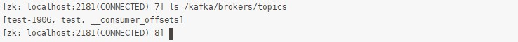

查看消息存储目录下的 topic 目录：

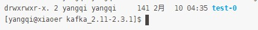

##### 查看主题

```shell
--describe 查看出来的信息，第一行是所有分区的总记录、配置等信息。之后的每一行代表一个分区信息。
	"leader" node节点是负责给定分区的所有读和写操作. Each node will be the leader for a randomly selected portion of the partitions。他后面跟的数字n就是broker的唯一id。
	"replicas" 是复制此分区的日志的节点列表，而不管这些节点是leader节点还是当前活动节点。后续跟的数字也是broker的唯一id。
	"isr" 是一系列“在同步”的副本。这是副本列表的子集，该列表当前处于活动状态并与leader节点保持联系。它后续跟的数字任然是broker的唯一id。

# 查看主题
[yangqi@xiaoer kafka-2.3.1]$ ./bin/kafka-topics.sh --describe --zookeeper xiaoer:2181,yangqi1:2181,yangqi2:2181/kafka --topic test
```

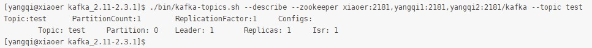

##### 主题修改

```shell
可以修改主题分区和配置属性等信息，不能修改副本因子，同时也不能将分区数越改越小
# 删除 test 主题的 flush.ms 配置，如果没有该属性将会显示已经更新
[yangqi@xiaoer kafka-2.3.1]$ ./bin/kafka-topics.sh --alter --zookeeper xiaoer:2181,yangqi1:2181,yangqi2:2181/kafka --topic test --delete-config flush.ms
```

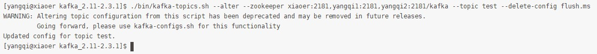

```shell
# 修改增加配置
[yangqi@xiaoer kafka-2.3.1]$ ./bin/kafka-topics.sh --alter --zookeeper xiaoer:2181,yangqi1:2181,yangqi2:2181/kafka --topic test --config flush.ms=1000
```

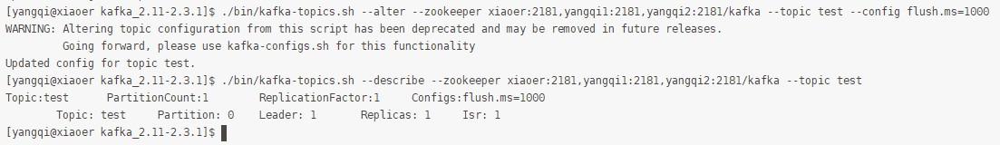

```shell
# 删除增加的配置
[yangqi@xiaoer kafka-2.3.1]$ ./bin/kafka-topics.sh --alter --zookeeper xiaoer:2181,yangqi1:2181,yangqi2:2181/kafka --topic test --delete-config flush.ms
```

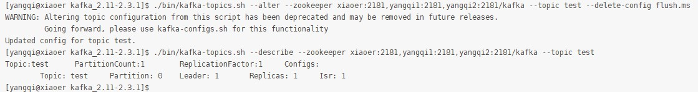

```shell
# 修改分区数量，注意不能修改分区因子（--replication-factor），同时不能修改成相同的分区数
[yangqi@xiaoer kafka-2.3.1]$ ./bin/kafka-topics.sh --alter --zookeeper xiaoer:2181,yangqi1:2181,yangqi2:2181/kafka  --partitions 3 --topic test
```

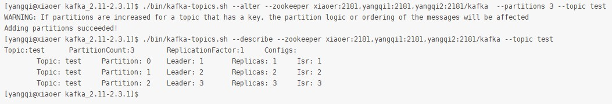

##### 删除主题

&emsp;&emsp;删除主题时，需要停止该删除`topic`相关的生产和消费者，否则会有意想不到的问题。同时如果`delete.topic.enable`的设置不是`true`，则是标记删除，也就不是真正的删除，可以使用`list`查看出来。而将`delete.topic.enable`设置为`true`时，所创建的信息都会给删除，即`zookeeper`中的`topics`的`znode`节点删除，删除对应的分区目录。

```shell
# 创建 test1 主题，设置副本数为2，分区数为3
[yangqi@xiaoer kafka-2.3.1]$ ./bin/kafka-topics.sh --create --zookeeper xiaoer:2181,yangqi1:2181,yangqi2:2181/kafka --replication-factor 2 --partitions 3 --topic test1

# 列出主题
[yangqi@xiaoer kafka-2.3.1]$ ./bin/kafka-topics.sh --list --zookeeper xiaoer:2181,yangqi1:2181,yangqi2:2181/kafka

# 查看主题
[yangqi@xiaoer kafka-2.3.1]$ ./bin/kafka-topics.sh --describe --zookeeper xiaoer:2181,yangqi1:2181,yangqi2:2181/kafka --topic test1

# 删除主题
[yangqi@xiaoer kafka-2.3.1]$ ./bin/kafka-topics.sh --delete --zookeeper xiaoer:2181,yangqi1:2181,yangqi2:2181/kafka --topic test1

# 列出主题
[yangqi@xiaoer kafka-2.3.1]$ ./bin/kafka-topics.sh --list --zookeeper xiaoer:2181,yangqi1:2181,yangqi2:2181/kafka
```

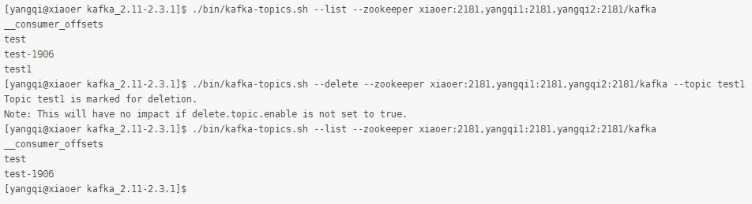

&emsp;&emsp;如果删除后并没有直接删除，需要在`server.properties`设置`delete.topic.enable=true`。在进行删除之前，一定要注意将需要被删除`topic`的`produce`和`consume`停止。如果有程序正在生产或者消费该`topic`，则该`topic`的`offset`信息会一直在`broker`更新。调用`kafka delete`命令无法删除该`topic`。同时，需要设置`auto.create.topics.enable=false`，默认值为`true`，如果设置为`true`，则`produce`或者`fetch`不存在的`topic`时也会自动创建该`topic`，所以删除之前一定要将`auto.create.topics.enable`设置为`false`，而且要认真停止该`topic`的生产和消费程序。

&emsp;&emsp;如果此时还有一些可能会有信息残留在`zookeeper`中，可以手动删除`zookeeper`中的相关信息。

```shell
# 找一个安装了 zookeeper 集群的机器
[yangqi@xiaoer kafka-2.3.1]$ zkCli.sh -server xiaoer:2181,yangqi1:2181,yangqi2:2181

# 删除该 topic 的信息
[zk: xiaoer:2181,yangqi1:2181,yangqi2:2181(CONNECTED) 0] rm /kafka/brokers/topics/test1
```

##### 生产消息

```shell
# 查看生产消息脚本的帮助
[yangqi@xiaoer kafka-2.3.1]$ ./bin/kafka-console-producer.sh

# 生产消息
[yangqi@xiaoer kafka-2.3.1]$ ./bin/kafka-console-producer.sh --broker-list xiaoer:9092,yangqi1:9092,yangqi2:9092 --topic test
>my test message is 1
>my test message is 2
>my test message is 3
>this is ok
```

##### 消费消息

```shell
# 查看消费消息脚本的帮助
[yangqi@xiaoer kafka-2.3.1]$ ./bin/kafka-console-consumer.sh

# 消费消息
[yangqi@xiaoer kafka-2.3.1]$ ./bin/kafka-console-consumer.sh --bootstrap-server xiaoer:9092,yangqi1:9092,yangqi2:9092 --from-beginning --topic test
```

##### 创建消费者组

```shell
命令不可创建消费者组，当使用 API 创建时，不存在则会自动创建
```

##### 消费者组列表

&emsp;&emsp;每一个消费者都属于一个消费者组，如果没有指定，则将会生成一个。查看`consumer group`列表有新、旧两种命令，分别查看新版（信息保存在`broker`中）`consumer`列表和老版（信息保存在`zookeeper`中）`consumer`列表，因而需要区分指定`bootstrap-server`和`zookeeper`参数。

```shell
# 新版命令
[yangqi@xiaoer kafka-2.3.1]$ ./bin/kafka-consumer-groups.sh --bootstrap-server xiaoer:9092,yangqi1:9092,yangqi2:9092 --list

# 老版命令（很多版本已经不兼容）
[yangqi@xiaoer kafka-2.3.1]$ ./bin/kafka-consumer-groups.sh --list --zookeeper xiaoer:2181,yangqi1:2181,yangqi2:2181/kafka
```

##### 删除消费者组

```shell
# 新版命令
[yangqi@xiaoer kafka-2.3.1]$ ./bin/kafka-consumer-groups.sh --delete --bootstrap-server xiaoer:9092,yangqi1:9092,yangqi2:9092 --group group-test

# 老版命令（要求在 zookeeper 中要存在）
[yangqi@xiaoer kafka-2.3.1]$ ./bin/kafka-consumer-groups.sh --delete --zookeeper xiaoer:2181,yangqi1:2181,yangqi2:2181/kafka --group group-test
```

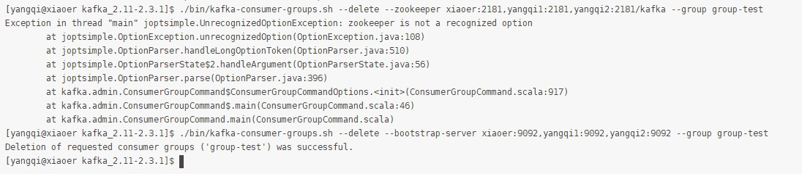

##### 查看消费位置

```shell
# 查看消费位置（0.9.x 版本）
[yangqi@xiaoer kafka-2.3.1]$ ./bin/kafka-run-class.sh kafka.tools.ConsumerOffsetChecker --bootstrap-server xiaoer:9092,yangqi1:9092,yangqi2:9092 --topic test

# 随便开启一个消费者，找到其 id，即消费组。查看其消费的位置信息。如果消费者组没被启用，将不会显示 CONSUMER-ID 及以后的信息
# 消费消息（在 xiaoer 机器上）
[yangqi@xiaoer kafka-2.3.1]$ ./bin/kafka-console-consumer.sh --bootstrap-server xiaoer:9092,yangqi1:9092,yangqi2:9092 --from-beginning --topic test
# 消费者组列表（在 yangqi1 机器上）
[yangqi@xiaoer kafka-2.3.1]$ ./bin/kafka-consumer-groups.sh --bootstrap-server xiaoer:9092,yangqi1:9092,yangqi2:9092 --list
# 查看消费者组（在 yangqi1 机器上）
[yangqi@xiaoer kafka-2.3.1]$ ./bin/kafka-consumer-groups.sh --bootstrap-server xiaoer:9092,yangqi1:9092,yangqi2:9092 --describe --group console-consumer-37253
```

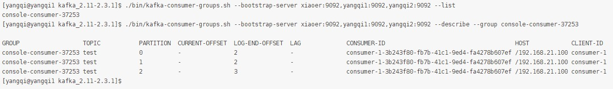

##### 平衡`leaderd`

&emsp;&emsp;当一个`broker`停止或者崩溃时，这个`broker`中所有分区的`leader`将转移给其他副本。这意味着在默认情况下，当这个`broker`重启之后，它的所有分区都将仅作为`follower`，不再用于客户端的读写操作。不过，在`Kafka`中有一个副本被称为优先副本（preferred replicas）的概念。如果一个分区有3个副本，且这3个副本的优先级分别为1，5，9，根据优先副本的概念，第一个副本1会作为5和9副本的`leader`。为了使`Kafka`集群恢复默认的`leader`，可以选择手动和自动另种平衡方式。

```shell
# 手动平衡 leader 命令
[yangqi@xiaoer kafka-2.3.1]$ ./bin/kafka-preferred-replica-election.sh --zookeeper xiaoer:2181,yangqi1:2181,yangqi2:2181/kafka

# 自动平衡 leader 操作
# Kafka 为我们提供了一个参数，可以使得 Kafka 集群自动平衡 leader，只需要在 server.properties 文件中配置如下配置：
auto.leader.rebalance.enable=true
# 这个值是默认开启的
```

##### `Kafka`压测命令

&emsp;&emsp;测试意义：验证每台服务器上`Kafka`写入消息和消费消息的能力，根据测试结果评估当前`Kafka`集群模式是否满足上亿级别的消息处理能力。

&emsp;&emsp;测试方法：在服务器上使用`Kafka`自带的测试脚本，分别模拟`10w`、`100w`和`1000w`的消息写入请求，查看`Kafka`处理不同数量级的消息数时的处理能力，包括每秒生成消息数、吞吐量、消息延迟时间。`Kafka`消息创建`topic`命名为`test-pref`，使用命令发起消费该`topic`的请求，查看`Kafka`消费不同数量级别的消息时的处理能力。

```shell
# 创建主题
[yangqi@xiaoer kafka-2.3.1]$ ./bin/kafka-topics.sh --create --zookeeper xiaoer:2181,yangqi1:2181,yangqi2:2181/kafka --replication-factor 1 --partitions 3 --topic test-pref
# 列出所有主题
[yangqi@xiaoer kafka-2.3.1]$ ./bin/kafka-topics.sh --list --zookeeper xiaoer:2181,yangqi1:2181,yangqi2:2181/kafka
```

###### `10w`条数据压力测试

```shell
# 写入 10w 条消息
[yangqi@xiaoer kafka-2.3.1]$ ./bin/kafka-producer-perf-test.sh --topic test-pref --num-records 100000 --record-size 1000 --throughput 2000 --producer-props bootstrap.servers=xiaoer:9092,yangqi1:9092,yangqi2:9092
# 消费 10w 条消息
[yangqi@xiaoer kafka-2.3.1]$ ./bin/kafka-consumer-perf-test.sh --broker-list xiaoer:9092,yangqi:9092,yangqi2:9092 --topic test-pref --fetch-size 1048576 --messages 100000 --threads 1
```

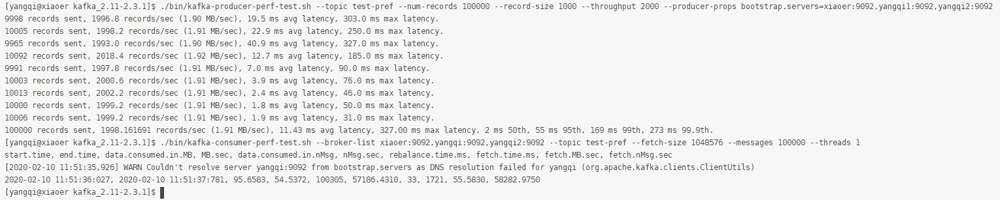

###### `100w`条数据压力测试

```shell
# 写入 100w 条消息
[yangqi@xiaoer kafka-2.3.1]$ ./bin/kafka-producer-perf-test.sh --topic test-pref --num-records 1000000 --record-size 2000 --throughput 5000 --producer-props bootstrap.servers=xiaoer:9092,yangqi1:9092,yangqi2:9092
# 消费 100w 条消息
[yangqi@xiaoer kafka-2.3.1]$ ./bin/kafka-consumer-perf-test.sh --broker-list xiaoer:9092,yangqi1:9092,yangqi2:9092 --topic test-pref --fetch-size 1048576 --messages 1000000 --threads 1
```

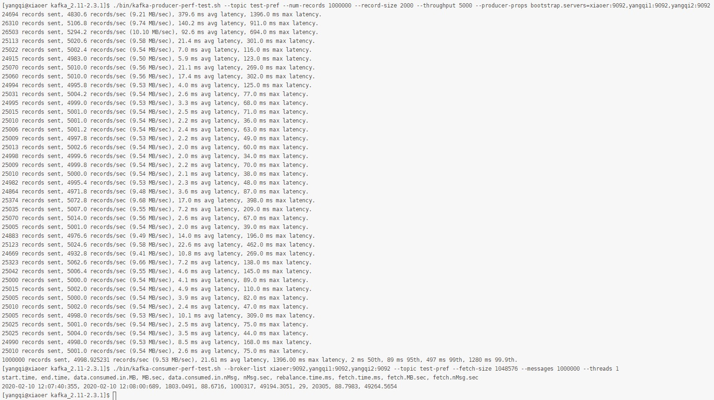

##### 副本管理

```shell
# default.replication.factor
每个 Partition 有几个副本，默认是 1，即只有 1 个副本（即不做备份）。创建时可以指定，但是创建后不能通过 alter 进行修改。
```

