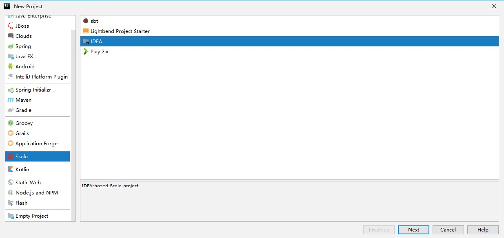
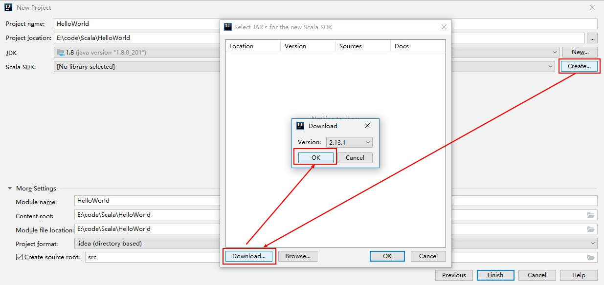
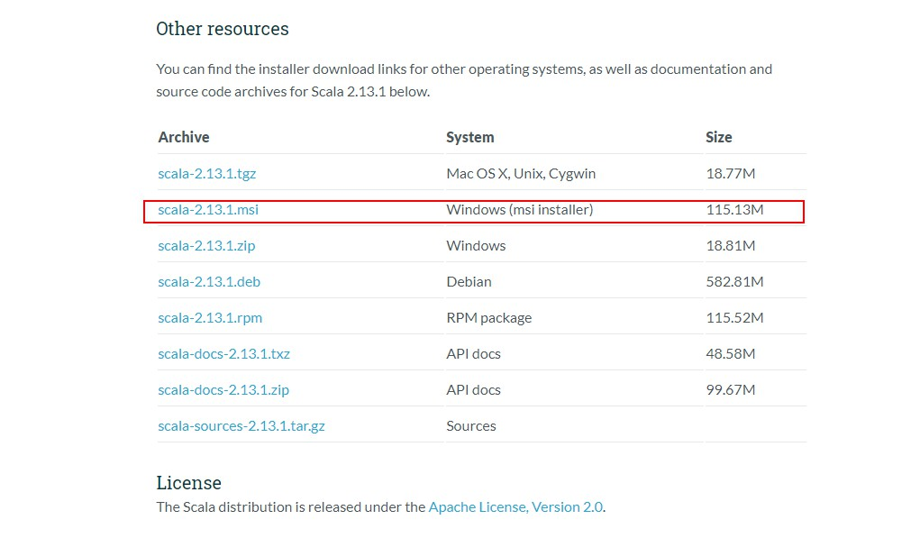
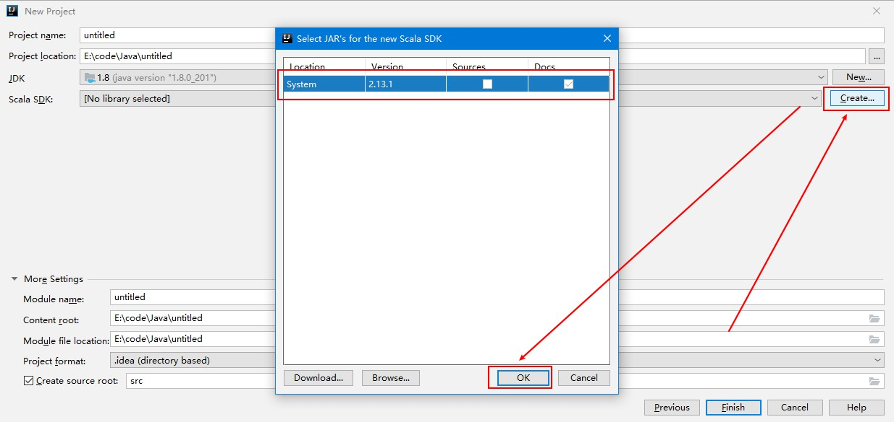
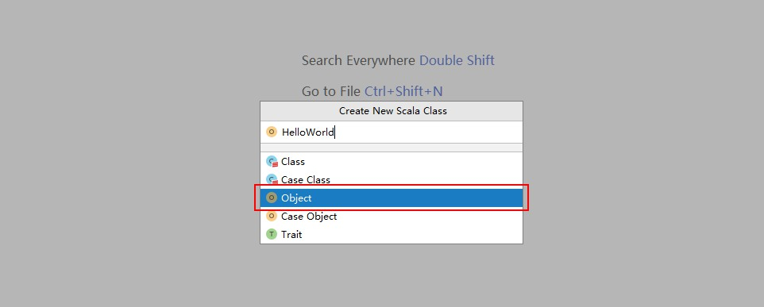

#### Scala简介及开发环境配置

##### Scala简介

---

###### 概念

Scala全称是Scalable Language，翻译为“可伸缩的语言”，这样命名的原因是因为它设计的目的是希望伴随用户的需求一起成长。Scala是一面面向对象和函数式编程概念的静态类型的编程语言，它运行在Java平台上，可以与所有的Java类库无缝协作。

###### 特点

Scala是一门以Java虚拟机（JVM）未运行环境的并将面向对象和函数式编程的最佳特性结合在一起静态类型编程语言

Scala是一门多范式（multi-paradigm）的编程语言，Scala支持面向对象和函数式编程

- 面向对象

  ```
  Scala是一种纯面向对象的语言，每个值都是对象，对象的数据类型以及行为由类和特质描述
  类抽象机制的扩展有两种途径：一种途径是子类继承，另一种途径是灵活的混入机制。这两种途径可以避免多重继承的各种问题
  ```

- 函数式编程

  ```
  Scala也是一种函数式语言，其函数也能当做值来使用。Scala提供了轻量级的语法用以定义匿名函数，支持高阶函数，允许嵌套多层函数。
  ```

###### Scala的优点

- 与Java兼容

  ```
  Scala可以与Java实现无缝对接，再执行时会被编译成Java字节码文件，这使得其与Java性能相当。Scala可以直接调用Java的方法、访问Java中的字段、继承Java类、实现Java接口。Scala重度复用并包装了原生的Java类型，并支持隐式转换
  ```

- 精简的语法

  ```
  Scala的程序通常比较简洁，相比于Java而言，代码行数会大幅度减少，这使得程序员对代码的阅读和理解更快，缺陷也更少
  ```

- 高级语言的特性

  ```
  Scala具有高级语言的特性，对代码进行了高级别的抽象，能够让你更好的控制程序的复杂度，保证开发的效率
  ```

- 静态类型

  ```
  Scala拥有非常先进的静态类型系统，Scala不仅拥有与Java类似的允许嵌套类的类型系统，还支持使用泛型对类型进行参数化，用交集（intersection）来组合类型，以及使用抽象类型来进行隐藏类型的细节。通过这些特性，可以更快的设计出安全易用的程序和接口
  ```

###### 创建Scala项目

在IDEA中依次点击`File-->New-->Project`选项卡，然后选择创建`Scala-IDEA`工程



###### 下载Scala SDK

- 通过IDEA自动下载

  &emsp;&emsp;此时可以看到`Scala SDK`为空，依次点击`Create-->Download`，版本使用默认即可，点击OK进行下载，下载完成后Finish即可（这种方式下载较慢）

  

- 手动下载Scala SDK并配置环境变量

  &emsp;&emsp;到Scala官网(https://www.scala-lang.org/download/)下载安装包，我这里是windows，所以下载`.msi`的安装包，版本为2.13.1

  

  - 下载完成之后，点击安装即可，安装完成后会自动配置环境变量

  - 此时打开IEDA，由于已经配置了环境变量，所以此时会选择对应版本的SDK（如果没有选择，可以点击`Create`进行选择）

    

###### 创建项目HelloWorld

在工程`HelloWorld`的目录`src`上`New-->Scala Class`创建`HelloWorld.scala`，输入以下代码，完成后点击运行即可，成功则代表搭建成功。

```scala
object HelloWorld extends App {
  println("Hello, World!");
}
```


> 在创建时，需要注意，创建`HelloWorld.scala`时，需要选择Object

