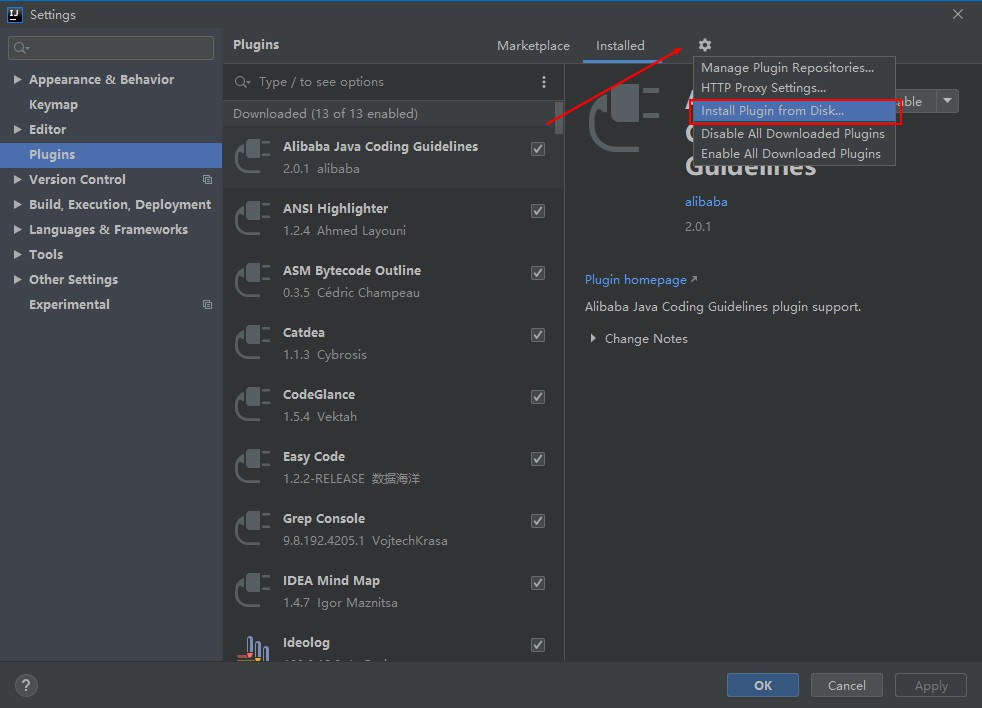
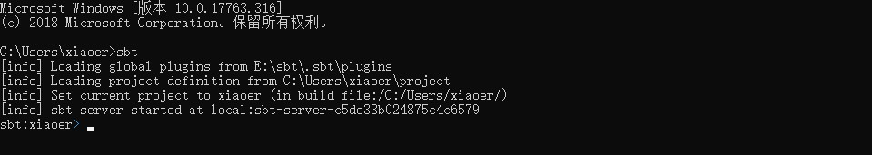

#### 搭建Scala开发环境

##### Windows 下搭建 Scala 开发环境

-  Scala 需要 Java 运行时库，安装 Scala需要首先安装 JVM 虚拟机并配置好

-  在 [Scala 官网](https://www.scala-lang.org/download/)下载对应的 Scala 安装包

-  配置 JDK 的环境变量和 Scala 环境变量

   ```
   配置环境变量 SCALA_HOME
   SCALA_HOME=D:\Programs\scala-2.11.12
   在 PATH 变量中添加：%SCALA_HOME%\bin
   ```

-  测试 Scala 环境变量是否配置成功：
   

##### Linux 下搭建 Scala 开发环境

-  在 [Scala 官网](https://www.scala-lang.org/download/)下载对应的 Linux 版本的 Scala 安装包(scala-2.11.12.tgz)

-  将下载好的 Scala 安装包解压到指定的目录下

   ```shell
   [yangqi@xiaoer software]$ sudo tar -zvxf scala-2.11.12.tgz -C ../apps/
   ```

-  配置环境变量（建议配置当前用户的环境变量）

   ```shell
   [yangqi@xiaoer software]$ vi ~/.bash_profile
   ```

   添加以下两句内容：

   ```shell
   export SCALA_HOME=/opt/apps/scala-2.11.12
   export PATH=$PATH:$SCALA_HOME/bin
   ```

   使环境变量生效：

   ```shell
   [yangqi@xiaoer software]$ source ~/.bash_profile
   ```

-  测试 Scala 环境

   ```shell
   [yangqi@xiaoer software]$ scala -version
   ```

   

##### IDEA 搭建 Scala 开发环境

###### 通过 Scala 的插件库进行安装

```
IDEA默认不支持Scala语言，需要通过插件进行扩展。一般情况下，可以直接打开IDEA，依次点击File-->setting-->plugins选项卡，搜索Scala插件，找到插件后直接安装，并重启IDEA生效。
```

###### 手动下载安装

-  下载地址：https://plugins.jetbrains.com/plugin/1347-scala/versions

-  下载完成后是一个`.zip`的压缩包，此时打开IDEA，依次点击`File-->setting-->plugins`选项卡

   

-  选择下载好的Scala的压缩包，之后重启IDEA就安装成功

##### IDEA 使用 SBT 搭建 Scala 开发环境

###### 下载和安装SBT

下载SBT的windows版本，可以下载msi和zip两种格式，[SBT下载](https://www.scala-sbt.org/download.html)。

将下载好的`sbt-1.3.5.zip`解压到安装目录，并且配置环境变量即可。


###### 配置SBT

在conf目录下，有一个sbtconfig.txt，添加以下内容（里面的路径指向的就是你自己的sbt仓库的存放路径）。

```
-Dsbt.log.format=true
-Dfile.encoding=UTF8
-Dsbt.global.base=e:/sbt/.sbt
-Dsbt.boot.directory=e:/sbt/.sbt/boot/
-Dsbt.repository.config=e:/sbt/.sbt/repo.properties
-Dsbt.ivy.home=e:/sbt/.ivy2
-Dsbt.override.build.repos=true
-Xmx512M
-Xss2M
-XX:+CMSClassUnloadingEnabled
```

将conf目录下的`repo.properties`复制到上面的指定目录，我复制到`E:/sbt/.sbt/`目录下即可。

修改`repo.properties`的内容为国内的镜像源，实测阿里云的不要好使，可以更换成华为的镜像源。

```properties
[repositories]
  	local
	huaweicloud-maven: https://repo.huaweicloud.com/repository/maven/
  	maven-central: https://repo1.maven.org/maven2/
  	huaweicloud-ivy: https://repo.huaweicloud.com/repository/ivy/, [organization]/[module]/(scala_[scalaVersion]/)(sbt_[sbtVersion]/)[revision]/[type]s/[artifact](-[classifier]).[ext]
```

方法一：配置完成之后，打开`cmd`执行`sbt`，等待下载完成即可



方法二：使用IDEA配置SBT，新建SBT项目，可以参照[使用IDEA和SBT构建Spark程序](https://www.yangqi199808.site/使用IDEA和SBT构建Spark程序/)这篇文章，之后打开IDEA设置


设置SBT的`VM parameters`，设置值和上面sbt目录下的`sbtconfig.txt`内容一致

```
-Dsbt.log.format=true
-Dfile.encoding=UTF8
-Dsbt.global.base=e:/sbt/.sbt
-Dsbt.boot.directory=e:/sbt/.sbt/boot/
-Dsbt.repository.config=e:/sbt/.sbt/repo.properties
-Dsbt.ivy.home=e:/sbt/.ivy2
-Dsbt.override.build.repos=true
-Xmx512M
-Xss2M
-XX:+CMSClassUnloadingEnabled
```

设置SBT的`Launcher`为`Custom`，选择自己sbt安装目录下的bin目录下的`sbt-launch.jar`即可


###### 扩展修改

若非必要情况，个人不建议修改以下内容。

可以将上面的`sbt-launch.jar`中的`/sbt/sbt.boot.properties`文件修改为以下内容。

```properties
[scala]
  version: ${sbt.scala.version-auto}

[app]
  org: ${sbt.organization-org.scala-sbt}
  name: sbt
  version: ${sbt.version-read(sbt.version)[1.3.5]}
  class: ${sbt.main.class-sbt.xMain}
  components: xsbti,extra
  cross-versioned: ${sbt.cross.versioned-false}
  resources: ${sbt.extraClasspath-}

[repositories]
  local
  oschina nexus:http://maven.oschina.net/content/groups/public/
  typesafe: http://repo.typesafe.com/typesafe/ivy-releases/, [organization]/[module]/(scala_[scalaVersion]/)(sbt_[sbtVersion]/)[revision]/[type]s/[artifact](-[classifier]).[ext], bootOnly
  maven-central
  sbt-plugins-repo: http://repo.scala-sbt.org/scalasbt/sbt-plugin-releases/, [organization]/[module]/(scala_[scalaVersion]/)(sbt_[sbtVersion]/)[revision]/[type]s/[artifact](-[classifier]).[ext]
  play: http://private-repo.typesafe.com/typesafe/maven-releases/
  sonatype-snapshots: https://oss.sonatype.org/content/repositories/snapshots
  typesafe-releases: https://repo.typesafe.com/typesafe/releases
  typesafe-ivy-releasez: https://repo.typesafe.com/typesafe/ivy-releases, [organization]/[module]/(scala_[scalaVersion]/)(sbt_[sbtVersion]/)[revision]/[type]s/[artifact](-[classifier]).[ext]

[boot]
  directory: ${sbt.boot.directory-${sbt.global.base-${user.home}/.sbt}/boot/}
  lock: ${sbt.boot.lock-true}

[ivy]
  ivy-home: ${sbt.ivy.home-${user.home}/.ivy2/}
  checksums: ${sbt.checksums-sha1,md5}
  override-build-repos: ${sbt.override.build.repos-false}
  repository-config: ${sbt.repository.config-${sbt.global.base-${user.home}/.sbt}/repositories}
```

