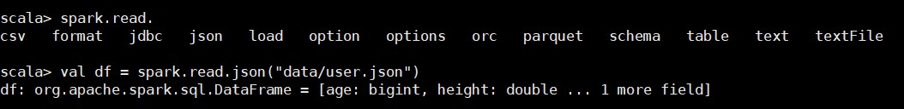

#### SparkSQL核心编程

##### 1. 构建SparkSQL环境

在老的版本中，SparkSQL提供了两种SQL查询起始点：一个SQLContext，用于Spark自己提供的SQL查询；一个HiveContext，用于连接Hive的查询。

SparkSession是Spark最新的SQL查询起始点，实际上是SQLContext和HiveContext的组合。SparkSession内部封装了SparkContext，所以计算实际上由SparkContext完成的。当我们使用Spark-shell的时候，spark框架会自动创建一个名称叫做spark的SparkSession对象。


##### 2. DataFrame

SparkSQL的DataFrame API允许我们使用DataFrame而不用必须去注册临时表或者生成SQL表达式。DataFrame API既有transformation操作也有action操作。

###### 1. 创建DataFrame

在SparkSQL中SparkSession是创建DataFrame和执行SQL的入口，创建DataFrame有三种方式：通过Spark的数据源进行创建；从一个存在的RDD进行转换；还可以从Hive Table进行查询返回。

- 从Spark数据源进行创建

  

  ```
  注意：如果是从内存中读取数据，spark可以知道数据类型具体是什么。如果是数字，默认作为Int处理；但是从文件中读取的数字，不能确定是什么类型，所以用bigint接受，可以喝Long类型转换，但是不能和Int进行转换。
  ```

- 从RDD进行转换

  

- 从HiveTable进行查询返回

###### 2. SQL语法

SQL语法风格是指我们在查询数据的时候使用SQL语法来查询，这种风格的查询必须要有临时视图或者全局视图来辅助。

- 读取JSON文件创建DataFrame

  

- 对DataFrame创建一个临时表

  

- 通过SQL语句实现查询全表

  

  ```
  注意：普通临时表是Session范围内的，如果想应用范围内有效，可以使用全局临时表。使用全局临时表时需要全路径访问。
  ```

- 对于DataFrame创建一个全局表

  

- 通过SQL实现查询全表

  

###### 3. DSL语法

DataFrame提供一个特定领域语言（domain-specific language，DSL）去管理结构化的数据。可以在Scala，Java，Python和R中使用DSL，使用DSL语法风格不必去创建临时视图了。

- 创建一个DataFrame

  

- 查看DataFrame的Schema信息

  

- 只查看“username”列数据

  

- 查看“username”列数据以及“age+1”数据

  

- 查看“age”大于“23”的数据

  

- 按照“age”分组，查看数据条数

  

###### 4. RDD转换为DataFrame

在IDEA中开发程序时，如果需要RDD与DF或者DS之间互相操作，那么需要引入`import spark.implicits._`


##### 3. DataSet

DataSet是具有强类型的数据集合，需要提供对应的类型信息。

###### 1. 创建DataSet

- 使用样例类序列创建DataSet

  

- 使用基本类型的序列创建DataSet

  

###### 2. RDD转换为DataSet


###### 3. DataSet转换为RDD


##### 4. DataFrame和DateSet转换

DataFrame其实是DataSet的特例，所以它们之间是可以相互转换的。

###### 1. DataFrame转换为DataSet


###### 2. DataSet转换为DataFrame


##### 5. RDD、DataFrame、DataSet三者的关系

###### 1. 三者的共性

- RDD、DataFrame、DataSet全都是spark平台下的分布式弹性数据集，为处理超大型数据提供便利
- 三者都有惰性机制，在进行创建、转换，如map方法时，不会立即执行，只有在遇到Action和foreach时，三者才会开始遍历运算
- 三者有许多共同的函数，如filter，排序等
- 在对DataFrame和DataSet进行操作许多都需要这个包`import spark.implicits._`（在创建好SparkSession对象后尽量直接导入）
- 三者都会根据Spark的内存情况自动缓存计算，这样即使数据量很大，也不会担心内存会溢出
- 三者都有partition的概念
- DataFrame和DataSet均可以使用模式匹配获取各个字段的值和类型

###### 2. 三者的区别

- RDD
  - RDD一般和spark mllib同时使用
  - RDD不支持sparksql操作
- DataFrame
  - 与RDD和DataSet不同，DataFrame每一行的数据类型固定为Row，每一列的值没法直接访问，只有通过解析才能获取各个字段的值
  - DataFrame与DataSet一般不与spark mllib同时使用
  - DataFrame与DataSet均支持SparkSQL的操作，比如select，groupby之类，还能注册临时表/视窗，进行sql语句操作
  - DataFrame与DataSet支持一些特别方便的保存方式，比如保存成csv，可以带上表头，这样每一列的字段名一目了然
- DataSet
  - DataSet和DataFrame拥有完全相同的成员函数，区别知识每一行的数据类型不同。DataFrame其实就是DataSet的一个特列：`type DataFrame = DataSet[Row]`
  - DataFrame也可以叫DataSet[Row]，每一行的类型都是Row，不解析，每一行究竟有那些字段，各个字段又是什么类型都无从得知，只能用getAs方法或者模式匹配拿出特定字段。而DataSet中，每一行是什么类型都是不一定的，在自定义了case class之后可以很自由的获取每一行的信息

###### 3. 三者的互相转换


##### 6. IDEA开发SparkSQL

```scala
package com.yankee.spark.sql

import org.apache.spark.SparkConf
import org.apache.spark.rdd.RDD
import org.apache.spark.sql.{DataFrame, Dataset, Row, SparkSession}

/**
 * @author Yankee
 * @date 2021/3/28 22:54
 */
object Spark01_SparkSQL_Basic {
  def main(args: Array[String]): Unit = {
    System.setProperty("HADOOP_USER_NAME", "hadoop")

    // TODO 创建环境
    val conf: SparkConf = new SparkConf().setMaster("local[*]").setAppName(this.getClass.getSimpleName.filter(!_.equals('$')))
    val spark: SparkSession = SparkSession.builder().config(conf).getOrCreate()
    import spark.implicits._

    // TODO 执行逻辑操作
    // TODO DataFrame
    val df: DataFrame = spark.read.json("data/user.json")
    // DataFrame => SQL
    df.createOrReplaceTempView("user")
    spark.sql("select * from user").show()
    spark.sql("select avg(age) from user").show()
    // DataFrame => DSL
    // 再使用DataFrame时，如果涉及到操作转换操作，需要引入转换规则
    df.select("age", "username").show()
    df.select($"age" + 1).show()
    df.select('age + 1).show()

    // TODO DataSet
    // DataFrame其实是特定泛型的DataSet
    val seq: Seq[Int] = Seq(1, 2, 3, 4)
    val ds: Dataset[Int] = seq.toDS()
    ds.show()

    // TODO RDD <=> DataFrame
    val rdd: RDD[(Int, String, Int)] = spark.sparkContext.makeRDD(List((1, "zhangsan", 30), (2, "lisi", 40)))
    val df1: DataFrame = rdd.toDF("id", "name", "age")
    val rowRDD: RDD[Row] = df1.rdd

    // TODO DataFrame <=> DataSet
    val ds1: Dataset[User] = df1.as[User]
    val df2: DataFrame = ds1.toDF()
    df2.show()

    // TODO RDD <=> DataSet
    val ds2: Dataset[User] = rdd.map {
      case (id, name, age) => User(id, name, age)
    }.toDS()
    val rdd2: RDD[User] = ds2.rdd
    rdd2.collect().foreach(println)

    // TODO 关闭环境
    spark.close()
  }

  case class User(id: Int, name: String, age: Int)
}
```

##### 7. 用户自定义函数

用户可以通过spark.udf功能添加自定义函数，实现自定义功能。

###### 1. UDF

```scala
/**
 * @author Yankee
 * @date 2021/3/28 22:54
 */
object Spark02_SparkSQL_UDF {
  def main(args: Array[String]): Unit = {
    System.setProperty("HADOOP_USER_NAME", "hadoop")

    // TODO 创建环境
    val conf: SparkConf = new SparkConf().setMaster("local[*]").setAppName(this.getClass.getSimpleName.filter(!_.equals('$')))
    val spark: SparkSession = SparkSession.builder().config(conf).getOrCreate()
    import spark.implicits._

    // TODO 执行逻辑操作
    val df: DataFrame = spark.read.json("data/user.json")
    df.createOrReplaceTempView("user")

    spark.udf.register("prefixName", (name: String) => {
      "Name: " + name
    })

    spark.sql("select age, prefixName(username) from user").show()

    // TODO 关闭环境
    spark.close()
  }
}
```

###### 2. 弱类型的UDAF

```scala
import org.apache.spark.SparkConf
import org.apache.spark.sql.expressions.{MutableAggregationBuffer, UserDefinedAggregateFunction}
import org.apache.spark.sql.types.{DataType, LongType, StructField, StructType}
import org.apache.spark.sql.{DataFrame, Row, SparkSession}

/**
 * @author Yankee
 * @date 2021/3/28 22:54
 */
object Spark03_SparkSQL_UDAF {
  def main(args: Array[String]): Unit = {
    System.setProperty("HADOOP_USER_NAME", "hadoop")

    // TODO 创建环境
    val conf: SparkConf = new SparkConf().setMaster("local[*]").setAppName(this.getClass.getSimpleName.filter(!_.equals('$')))
    val spark: SparkSession = SparkSession.builder().config(conf).getOrCreate()

    // TODO 执行逻辑操作
    val df: DataFrame = spark.read.json("data/user.json")
    df.createOrReplaceTempView("user")

    spark.udf.register("avgAge", new MyAvgUDAF())

    spark.sql("select avgAge(age) from user").show()

    // TODO 关闭环境
    spark.close()
  }

  /**
   * 自定义聚合函数：计算年龄的平均值
   *  1.继承UserDefinedAggregateFunction
   *  2.重写方法（8个）
   */
  class MyAvgUDAF extends UserDefinedAggregateFunction {
    // 输入数据的结构：In
    override def inputSchema: StructType = {
      StructType(
        Array(
          StructField("age", LongType)
        )
      )
    }

    // 缓冲区数据的结构：Buffer
    override def bufferSchema: StructType = {
      StructType(
        Array(
          StructField("total", LongType),
          StructField("count", LongType)
        )
      )
    }

    // 函数计算结果的数据类型：Out
    override def dataType: DataType = LongType

    // 函数的稳定性
    override def deterministic: Boolean = true

    // 缓冲区初始化
    override def initialize(buffer: MutableAggregationBuffer): Unit = {
      //buffer(0) = 0L
      //buffer(1) = 0L
      buffer.update(0, 0L)
      buffer.update(1, 0L)
    }

    // 输入的值跟新缓冲区数据
    override def update(buffer: MutableAggregationBuffer, input: Row): Unit = {
      buffer.update(0, buffer.getLong(0) + input.getLong(0))
      buffer.update(1, buffer.getLong(1) + 1)
    }

    // 缓冲区数据合并
    override def merge(buffer1: MutableAggregationBuffer, buffer2: Row): Unit = {
      buffer1.update(0, buffer1.getLong(0) + buffer2.getLong(0))
      buffer1.update(1, buffer1.getLong(1) + buffer2.getLong(1))
    }

    // 计算平均值
    override def evaluate(buffer: Row): Any = {
      buffer.getLong(0) / buffer.getLong(1)
    }
  }
}
```

###### 3. 强类型的UDAF

- 高版本的实现方式

  ```scala
  import org.apache.spark.SparkConf
  import org.apache.spark.sql.{DataFrame, Encoder, Encoders, SparkSession, functions}
  import org.apache.spark.sql.expressions.Aggregator
  
  /**
   * @author Yankee
   * @date 2021/3/28 22:54
   */
  object Spark04_SparkSQL_UDAF {
    def main(args: Array[String]): Unit = {
      System.setProperty("HADOOP_USER_NAME", "hadoop")
  
      // TODO 创建环境
      val conf: SparkConf = new SparkConf().setMaster("local[*]").setAppName(this.getClass.getSimpleName.filter(!_.equals('$')))
      val spark: SparkSession = SparkSession.builder().config(conf).getOrCreate()
  
      // TODO 执行逻辑操作
      val df: DataFrame = spark.read.json("data/user.json")
      df.createOrReplaceTempView("user")
  
      // 2.4.6版本中未涉及
      spark.udf.register("avgAge", functions.udaf(new MyAvgUDAF()))
  
      spark.sql("select avgAge(age) from user").show()
  
      // TODO 关闭环境
      spark.close()
    }
  
    /**
     * 自定义聚合函数：计算年龄的平均值
     * 1.继承org.apache.spark.sql.expressions.Aggregator，定义泛型
     * IN：输入的数据类型
     * BUF：Buff缓冲区数据类型
     * OUT：输出的数据类型
     * 2.重写方法（6个）
     */
    case class Buff(var total: Long, var count: Long)
  
    class MyAvgUDAF extends Aggregator[Long, Buff, Long] {
      // 初始值或零值
      // 缓冲区的初始化
      override def zero: Buff = {
        Buff(0, 0L)
      }
  
      // 根据输入的数据来更新缓冲区的数据
      override def reduce(buff: Buff, in: Long): Buff = {
        buff.total = buff.total + in
        buff.count += 1
        buff
      }
  
      // 合并缓冲区
      override def merge(buff1: Buff, buff2: Buff): Buff = {
        buff1.total = buff1.total + buff2.total
        buff1.count += buff2.count
        buff1
      }
  
      // 计算结果
      override def finish(reduction: Buff): Long = {
        reduction.total / reduction.count
      }
  
      // 缓冲区的编码操作
      override def bufferEncoder: Encoder[Buff] = Encoders.product
  
      // 输出的编码操作
      override def outputEncoder: Encoder[Long] = Encoders.scalaLong
    }
  }
  ```

- 早期版本的实现方式

  ```scala
  import org.apache.spark.SparkConf
  import org.apache.spark.sql.expressions.Aggregator
  import org.apache.spark.sql._
  
  /**
   * @author Yankee
   * @date 2021/3/28 22:54
   */
  object Spark04_SparkSQL_UDAF2 {
    def main(args: Array[String]): Unit = {
      System.setProperty("HADOOP_USER_NAME", "hadoop")
  
      // TODO 创建环境
      val conf: SparkConf = new SparkConf().setMaster("local[*]").setAppName(this.getClass.getSimpleName.filter(!_.equals('$')))
      val spark: SparkSession = SparkSession.builder().config(conf).getOrCreate()
  
      // TODO 执行逻辑操作
      val df: DataFrame = spark.read.json("data/user.json")
      df.createOrReplaceTempView("user")
  
      // 早期版本中，不能在sql中使用强类型的UDAF操作
      // 早期的UDAF强类型聚合函数使用DSL语法操作
      import spark.implicits._
      val ds: Dataset[User] = df.as[User]
  
      // 将查询的UDAF函数转换为查询的列对象
      val udafCol: TypedColumn[User, Long] = new MyAvgUDAF().toColumn
  
      ds.select(udafCol).show()
  
      // TODO 关闭环境
      spark.close()
    }
  
    /**
     * 自定义聚合函数：计算年龄的平均值
     * 1.继承org.apache.spark.sql.expressions.Aggregator，定义泛型
     * IN：输入的数据类型
     * BUF：Buff缓冲区数据类型
     * OUT：输出的数据类型
     * 2.重写方法（6个）
     */
    case class User(username: String, age: Long, height: Double)
  
    case class Buff(var total: Long, var count: Long)
  
    class MyAvgUDAF extends Aggregator[User, Buff, Long] {
      // 初始值或零值
      // 缓冲区的初始化
      override def zero: Buff = {
        Buff(0, 0L)
      }
  
      // 根据输入的数据来更新缓冲区的数据
      override def reduce(buff: Buff, in: User): Buff = {
        buff.total = buff.total + in.age
        buff.count += 1
        buff
      }
  
      // 合并缓冲区
      override def merge(buff1: Buff, buff2: Buff): Buff = {
        buff1.total = buff1.total + buff2.total
        buff1.count += buff2.count
        buff1
      }
  
      // 计算结果
      override def finish(reduction: Buff): Long = {
        reduction.total / reduction.count
      }
  
      // 缓冲区的编码操作
      override def bufferEncoder: Encoder[Buff] = Encoders.product
  
      // 输出的编码操作
      override def outputEncoder: Encoder[Long] = Encoders.scalaLong
    }
  }
  ```

##### 8. 数据的加载和保存

###### 1. 通用的加载和保存方式

SparkSQL提供了通用的保存数据和数据加载的方式。这里的通用是指使用相同的API，根据不同的参数读取和保存不同格式的数据，SparkSQL默认读取和保存的文件格式为parquet。

- 加载数据

  `spark.read.load`是加载数据的通用方法

  ```scala
  scala> spark.read.
  csv format jdbc json load option options orc parquet schema table text textFile
  ```

  如果读取不同格式的数据，可以对不同的数据格式进行设定：

  ```scala
  scala> spark.read.format("...")[.option("...")].load("...")
  ```

  ```
  format("...")：指定加载的数据类型，包括csv、jdbc、json、orc、parquet和textFile
  load("...")：在csv、jdbc、json、orc、parquet和textFile格式下需要传入加载数据的路径
  option("...")：在jdbc格式下需要传入JDBC相应的参数，url、user、password和dbtable
  ```

  直接在文件上查询：文件格式.文件路径

  ```scala
  scala> spark.sql("select * from json.`/home/hadoop/user.json`").show
  ```

- 保存数据

  `df.write.save`是保存数据的通用方法

  ```scala
  scala> df.write.
  csv jdbc json orc parquet textFile ...
  ```

  如果保存不同格式的数据，可以对不同的数据格式进行设定

  ```scala
  scala> df.write.format("...")[.option("...")].save("...")
  ```

  ```
  format("...")：指定保存的数据类型，包括csv、jdbc、json、orc、parquet和parquet
  save("...")：在csv、orc、parquet和textFile格式下需要传入保存数据的路径
  option("...")：在jdbc格式下需要传入JDBC相应参数，url、user、password和dbtable
  ```

  保存报错可以使用`SaveMode`，用来指明如何处理数据，使用`mode()`方法来设置。重要的是SaveMode都是没有加锁的，也不是原子操作。

  | Scala/Java                      | Any Language     | Meaning                    |
  | ------------------------------- | ---------------- | -------------------------- |
  | SaveMode.ErrorIfExists(default) | "error"(default) | 如果文件已经存在则抛出异常 |
  | SaveMode.Append                 | "append"         | 如果文件已经存在则追加     |
  | SaveMode.Overwrite              | "overwrite"      | 如果文件已经存在则覆盖     |
  | SaveMode.Ignore                 | "ignore"         | 如果文件已经存在则忽略     |

  ```scala
  df.write.mode("append").json("/home/hadoop/user.json")
  ```

###### 2. Parquet

SparkSQL的默认数据源为`Parquet`格式。`Parquet`是一种能够有效存储嵌套数据的列式存储格式。数据源为`Parquet`文件时，SparkSQL可以方便的执行所有的操作，不需要使用`format`，修改配置项`spark.sql.source.default`，可以修改数据源默认格式。

- 加载数据

  

- 保存数据

  

###### 3. JSON

SparkSQL能够通过自动推测JSON数据集的结构，并将它加载为一个`DataSet[Row]`，可以通过`SparkSession.read.json()`去加载JSON文件。

注意：Spark读取的JSON文件每一行都应该是一个JSON串。

- 加载数据

  

- 保存数据

  

###### 4. CSV

SparkSQL可以配置CSV文件的列表信息，读取CSV文件，CSV文件的第一行设置为数据列。


###### 5. MySQL

```scala
import org.apache.spark.SparkConf
import org.apache.spark.sql.{DataFrame, SaveMode, SparkSession}

/**
 * @author Yankee
 * @date 2021/4/1 10:55
 */
object Spark01_SpakSQL_JDBC {
  def main(args: Array[String]): Unit = {
    // TODO SparkSQL的运行环境
    val conf: SparkConf = new SparkConf().setMaster("local[*]").setAppName(this.getClass.getSimpleName.filter(!_.equals('$')))
    val spark: SparkSession = SparkSession.builder().config(conf).getOrCreate()

    // TODO 业务逻辑
    // 读取MySQL的数据
    val df: DataFrame = spark.read
      .format("jdbc")
      .option("url", "jdbc:mysql://master:3306/spark-sql")
      .option("driver", "com.mysql.jdbc.Driver")
      .option("user", "yangqi")
      .option("password", "xiaoer")
      .option("dbtable", "user")
      .load()

    // 保存数据
    df.write
      .format("jdbc")
      .option("url", "jdbc:mysql://master:3306/spark-sql?userUnicode=true&characterEncoding=utf8")
      .option("driver", "com.mysql.jdbc.Driver")
      .option("user", "yangqi")
      .option("password", "xiaoer")
      .option("dbtable", "people")
      .mode(SaveMode.Append)
      .save()

    // TODO 关闭环境
    spark.close()
  }
}
```

###### 6. Hive

如果需要在SparkSQL中包含Hive的库，并不需要事先安装Hive。如果要把SparkSQL连接到一个部署好的Hive上，你需要将`hive-site.xml`复制到Spark的conf目录下。

`spark-shell`默认是Hive支持的；代码中默认不支持，需要手动指定（加一个参数即可）。

- 内嵌的HIVE

  如果使用Spark内嵌的Hive，则什么都不用做，直接使用即可。

- 外部的HIVE

  ```
  - Spark要接管Hive需要把hive-site.xml拷贝到conf/目录下
  - 把MySQL的驱动copy到jars/目录下
  - 如果访问不到HDFS，则需要把core-site.xml和hdfs-site.xml拷贝到conf/目录下
  - 重启spark-shell
  ```

  

  

- 运行Spark SQL CLI

  Spark SQL CLI可以很方便的在本地运行Hive元数据服务以及从命令行执行查询任务。在Spark目录下执行如下命令启动Spark SQL CLI，直接执行SQL语句。

  ```
  bin/spark-sql
  ```

- 运行Spark beeline

  Spark Thrift Server是Spark社区基于HiveServer2实现的一个Thrift服务。旨在无缝兼容HiveServer2。因为Spark Thrift Server的接口和协议都和HiveServer2完全一致，因此我们部署好Spark Thrift Server后，可以直接使用hive的beeline访问Spark Thrift Server执行相关语句。Spark Thrift Server的目的也只是取代HiveServer2，因此它依旧可以和Hive Metastore进行交互，获取到hive的元数据。

  ```
  - Spark要接管Hive需要把hive-site.xml拷贝到conf/目录下
  - 把MySQL的驱动copy到jars/目录下
  - 如果访问不到HDFS，则需要把core-site.xml和hdfs-site.xml拷贝到conf/目录下
  - 启动Thrift Server：sbin/start-thriftserver.sh
  - 使用beeline连接Thrift Server：bin/beeline -u jdbc:hive2://slave2:10000 -n hadoop
  ```

  

- 代码操作Hive

  ```scala
  import org.apache.spark.SparkConf
  import org.apache.spark.sql.SparkSession
  
  /**
   * @author Yankee
   * @date 2021/4/1 13:24
   */
  object Spark02_SparkSQL_Hive {
    def main(args: Array[String]): Unit = {
      System.setProperty("HADOOP_USER_NAME", "hadoop")
  
      // TODO 创建SparkSession环境
      val conf: SparkConf = new SparkConf().setMaster("local[*]").setAppName(this.getClass.getSimpleName.filter(!_.equals('$')))
      val spark: SparkSession = SparkSession.builder().enableHiveSupport().config(conf).getOrCreate()
  
      // TODO 业务逻辑
      // 使用SparkSQL连接外置Hive
      // 1.拷贝hive-site.xml文件到resource目录下
      // 2.启用Hive的支持
      // 3.增加对应的依赖关系（包含MySQL的驱动）
      spark.sql("show databases").show()
      spark.sql("select * from ids").show()
  
      // TODO 关闭环境
      spark.close()
    }
  }
  ```