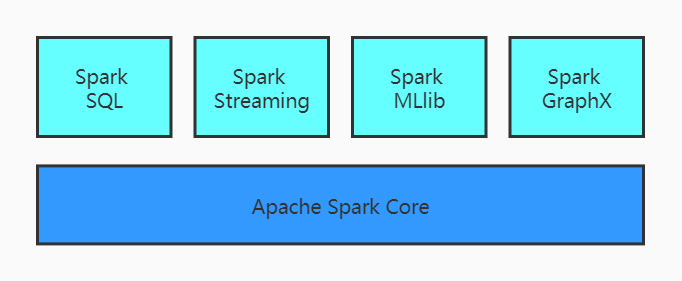

#### Spark简介

##### 1. 什么是Spark

```
Spark是一种基于内存的快速、通用、可扩展的大数据分析计算引擎
```

##### 2. Spark和Hadoop

```
- Hadoop
	- Hadoop是由Java语言编写的，在分布式服务器集群上存储海量数据并运行分布式分析应用的开源框架
	- 作为Hadoop分布式文件系统，HDFS处于Hadoop生态圈的最底层，存储着所有的数据，支持着Hadoop的所有服务。它的理论基础源于Google的《TheGoogleFileSystem》这篇论文，是GFS的开源实现
	- MapReduce是一种编程模型，Hadoop根据Google的《MapReduce》论文将其实现，作为Hadoop的分布式计算模型，是Hadoop的核心。基于这个框架，分布式并行程序的编写变得异常简单。综合了HDFS的分布式存储和MapReduce的分布式计算，Hadoop在处理海量数据时，性能横向扩展变得非常容易
	- HBase是对Google的《Bigtable》的开源实现，但又和Bigtable存在许多不同之处。HBase是一个基于HDFS的分布式数据库，擅长实时地随机读/写超大规模数据集。它也是Hadoop非常重要的组件
	
- Spark
	- Spark是一种由Scala语言开发的快速、通用、可扩展的大数据分析引擎
	- Spark Core中提供了Spark最基础与最核心的功能
	- Spark SQL是Spark用来操作机构化数据的组件。通过Spark SQL，用户可以使用SQL或者Apache Hive版本的SQL方言（HQL）来查询数据
	- Spark Streaming是Spark平台上针对实时数据进行流式计算的组件，提供了丰富的处理数据流的API
```

##### 3. Spark与Hadoop的优劣

```
- Hadoop MapReduce由于其设计初衷并不是为了满足循环迭代式数据流处理，因此在多并行运行的数据可复用场景（如：机器学习、图挖掘算法、交互式数据挖掘算法）中存在诸多计算效率问题。因为MapReduce只有Map和Reduce两种计算模型，在进行复杂计算时，需要将数据尽量去进行多次的Map和Reduce，甚至需要把上一步Reduce计算的结果作为下一个Map的数据源，这样会增加多次和磁盘的交互，影响效率。Spark在传统的MapReduce计算框架的基础上，利用其计算过程的优化，从而大大加快了数据分析、挖掘的运行和读写速度，并将计算单元缩小到更合适并行计算和重复使用的RDD计算模型
- 机器学习中ALS、凸优化梯度下降等。这些都需要基于数据集或者数据集的衍生数据反复查询反复操作。MR这种模式不太适合，即使多MR串行处理，性能和时间也是一个问题。数据的共享依赖于磁盘。另外一种是交互式数据挖掘，MR显然不擅长。而Spark所基于的Scala语言恰恰擅长函数的处理
- Spark是一个分布式数据快速分析项目。它的核心技术是弹性分布式数据集（Resilient Distributed Datasets），提供了比MapReduce丰富的模型，可以快速在内存中对数据集进行多次迭代，来支持复杂的数据挖掘算法和图形计算算法
- Spark和Hadoop的根本差异是多个作业之间的数据通信问题：Spark多个作业之间数据通信是基于内存，而Hadoop是基于磁盘
- Spark Task的启动时间快。Spark采用fork线程的方式，而Hadoop采用创建新的进程的方式
- Spark只有在shuffle的时候将数据写入磁盘，而Hadoop中多个MR作业之间的数据交互都要依赖于磁盘交互
- Spark的缓存机制比HDFS的缓存机制高效
```

##### 4. Spark核心模块



```
- Spark Core：Spark Core中提供了Spark最基础与最核心的功能，Spark其他的功能如：Spark SQL，Spark Streaming，Spark MLlib，Spark GraphX都是在Spark Core的基础上进行扩展的
- Spark SQL：Spark SQL是Spark用来操作结构化数据的组件。通过Spark SQL，用户可以使用SQL或者Apache Hive版本的方言（HQL）来查询数据
- Spark Streaming：Spark Streaming是Spark平台上针对实时数据进行流式计算的组件，提供了丰富的处理数据流的API
- Spark MLlib：MLlib是Spark提供的一个机器学习算法库。MLlib不仅提供了模型评估、数据导入等额外的功能，还提供了一些更底层的机器学习原语
- Spark GraphX：GraphX是Spark面向图计算提供的框架与算法库
```


